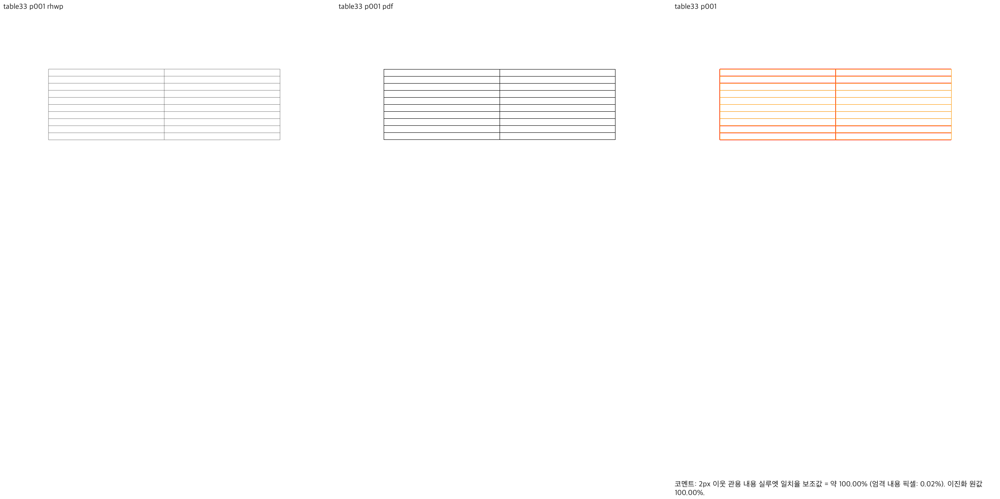
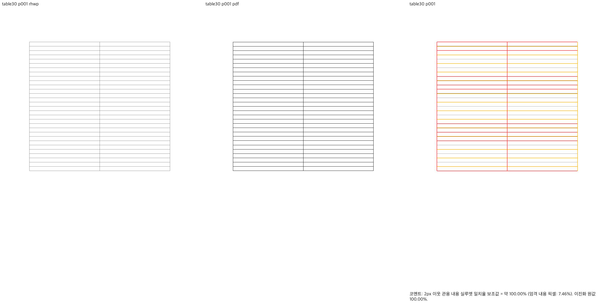
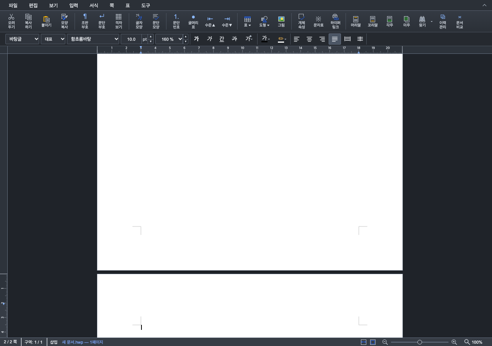

# #7486 — 표 뒤 Enter의 빈 줄 소유권 보정

Issue: [#7486](https://github.com/edwardkim/rhwp/issues/7486). 앞서 병합된 Studio 보고서와 구분하기 위해
이번 표 경로의 보고서는 `_table_report.md` 이름으로 유지한다.

## 최신 판정 — 범위 분리 후에도 저장 guide 검증으로 병합 보류

2026-10-07 최신 base `48ff4bb935`에서 #7207 정렬 보정을 분리한 뒤 원 PR을
로컬 병합한 code head `2b034275a5`를 재검증했다. 최소 선행 후보는
[#7627](https://github.com/edwardkim/rhwp/pull/7627)로 `7076f836e2`에 병합됐다.
그 devel을 정렬한 로컬 head `4d9889a7f4`의 source/test는 위 검증 source와 동일하다.
원격 #7544의 source와 초기 본문은 유지하고 [최신 검토 댓글](https://github.com/edwardkim/rhwp/pull/7544#issuecomment-6031830291)을 게시했다. Native/fresh WASM의 어구 전21쪽
최저93.22327%, Enter4개 원문 전7쪽 최저100%이며 관련 기존 검사9개는 통과했다.
교육과정 guide171/172쪽의 Native 실패 및 전체413/415쪽 차이는 남고, 이 source의
fresh WASM guide·전체 Rust/lint/CI는 미검증이다. 교육과정 전체 보정을 인수하지 않는다.
정확한 source·입력·대표 PNG와 판정은 [최신 self-review](../pr/archives/pr_7544_review.md#2026-10-07-범위-분리-후-로컬-후보-재검증)에 연결한다.

## 2026-10-03 실제 저장본 재검증 — 당시 이력

제출 때 합성 반복 Enter 입력 4개의 통과를 실제 저장본 종료 guide 검증과 충분히 구분하지 못했다.
2026-10-03 누락된 비교를 실행한 결과, Native/fresh WASM 모두 `pr_review_gate=re_review_required`다.
어구 문서는21/21쪽이나 전21쪽 최저14.72666%, 90% 미만16쪽이며20/21쪽 지도 소유·배치가 다르다.
교육과정은413/415쪽으로 전쪽 TSV가 쪽수 불일치로 실패했고, 같은171/172쪽은66.33053%/24.00083%다.
선택2쪽 점수를 전체415쪽의 검증으로 보고하지 않는다. 대표 review·standalone overlay를 직접 판독했다.

어구는 동일 원문의 독립 한컴 PDF를 확보했으며, 교육과정 PDF는 기존 정상415쪽 기준을
재사용했다. 원문·PDF·빌드·전후 출력 해시와 실행 범위는
[실제 저장본 재검증 원장](../working/assets/issue7486-table-enter/stored-guide-recheck.json)에 보존했다.
수정 전 base에서도 어구20/21쪽 출력이 동일하고 교육과정의413/415쪽 차이가 존재한다.
교육과정171쪽은 소량 픽셀 차이가 있어 전체 바이트 동일로 기록하지 않는다.
기존 결함이라는 분류와 현재 gate 실패를 구분하며, 승인·병합 조건을 충족했다고 보고하지 않는다.

당시 사용자 선택에 따라 보정은 실패 증적·self-review·오늘할일 기록에 한정했다.
어구 출력은 [#7207](https://github.com/edwardkim/rhwp/issues/7207), 교육과정은
[#7445의 기존 등록](https://github.com/edwardkim/rhwp/issues/7445#issuecomment-5874264216)에 분리해 추적한다.
renderer·회귀·baseline·허용치는 변경하지 않았다. 자세한 판정·실패 대표 이미지와 초기 리뷰 정정은
[PR #7544 self-review](../pr/archives/pr_7544_review.md#2026-10-03-실제-저장본-재검증--미충족)에 연결했다.
아래7쪽 시각 통과는 합성 반복 Enter 범위의 과거 검증이다.

## 범위·원인

최신 `devel` `e1ecaa248ecf7f667d8fccab4d9938e70a253392`에서
`codex/table-enter-page-ownership`을 만들었다. 사용자가 로컬 수정 결과를 직접 확인했고 PR 제출 준비를
승인했다. remote push와 Open PR #7544 생성을 수행했다. 기존 #7487/#7539를 다시 게시하거나 수정하지 않는다.

10×2 위아래 표 뒤의 160% Enter33~39에서 확정된 빈 쪽을 `pages.pop()`으로 지워 문단 소속이
사라졌다. 표 높이가 빠진 저장 vpos에 overflow 예외를 더하는 대신, 가시 텍스트가 없으면 공간도
없다고 보는 사후 삭제를 제거했다. 이미 fit·배치가 확정한 줄 상자와 페이지를 보존한다.

같은 원칙의 반례로 30×2 표·300%·Enter9를 실행했다. 앞 빈 줄의 누적 간격이 본문을 조금
넘쳤다는 이유로 다음 줄을 `Hidden` 처리하는 `trailing_disposition` 분기도 제거했다.
문단 자체의 미세 overflow 흡수, 각주 예약, 명시적 `hide_empty_line` 설정과 RowBreak guide 판단은 유지한다.
문서 ID·표 크기·임의 숫자 예외와 좌표 clamp를 추가하지 않았다.

실제 생산·소비 경로와 선행 진단은 [단계 기록](../working/task_m100_7486_table_stage1.md)에 연결했다.
표 컷·rowspan·요구/예약 높이·paint는 변경하지 않는다. 일반 문단 fit 실패 → 첫 줄 이월 →
같은 `FormattedParagraph` advance의 실제 배치 → 확정 PageContent → 최종 소유 조회를 보존하는 변경이다.

## 독립 기준과 시각 선행 조건

실제 편집 API로 생성·저장한 합성 HWPX를 수동 XML 수정 없이 보존했다. 같은 원문의
독립 한컴 PDF를 확보했다. 입력 저장 제품은 `hancom-office-2020`이다. HOffice120 호환 profile의
`pdf_output_mode=hancom2020_pdf_driver_one_up`, 한컴 11.0.0.9136, 파일 서명·SHA-256을 확인했다.
변환 인증 정보는 증적에 포함하지 않는다.

합성 편집 fixture는 `tests/fixtures/issue7486_table_enter/`에, 대응 한컴 PDF는
`pdf/issue7486_<원문 stem>-2020.pdf`에 보존했다. 최초 assets 경로의 같은 바이트를 옮겼으며
XML·LineSeg·PDF 내용은 변경하지 않았다. 각 파일의 저장소 경로·SHA-256은 validation.json의
`inputPaths`와 `files`에 연결했다. 최종 sweep는 이 저장소 경로를 사용한다.

| 입력 | 한컴 PDF | Native | fresh WASM | 각 backend 전체 쪽 최저 실루엣 |
| --- | ---: | ---: | ---: | ---: |
| 10×2·160%·Enter32 | 1쪽 | 1쪽 | 1쪽 | 100% |
| 10×2·160%·Enter33 | 2쪽 | 2쪽 | 2쪽 | 100% |
| 10×2·160%·Enter40 | 2쪽 | 2쪽 | 2쪽 | 100% |
| 30×2·300%·Enter9 | 2쪽 | 2쪽 | 2쪽 | 100% |

회귀 추가 전 시각 선행 검증 source는 `75b433ccbe58ccf297a4f0ddbc6db83a1b850910`이다. 최종 제출 source는
`97772d5d40787e77c3238debc2b2576b11713476`이며 입력·PDF·빌드 해시는
[validation.json](../working/assets/issue7486-table-enter/validation.json)에 기록했다.
선행 검증은 wrapper의 dev WASM을, 최종 재검증은 **release `--no-opt` host WASM**을 사용했고
root pkg/public JS·WASM 해시 일치를 확인했다. Native는 같은 source의 `release-test` CLI다.
96dpi·print profile·고정 2px 관용으로 전체 7쪽 × 2 backend를 비교했다.
측정 미달·누락 쪽, 글꼴 예외, 비교 영역 변경은 없다. 정식 회귀 추가 **전에** 이 조건을 충족했다.

표 외곽·행/열 경계·시작/끝 위치는 PDF와 일치하며 다음 쪽은 양쪽 모두 빈 쪽이다.
rhwp의 표 선은 PDF보다 밝다. 실루엣 100%를 선 색상·전체 피델리티 100%로 보고하지 않는다.

| 대표 경계 | Native | fresh WASM |
| --- | --- | --- |
| 10행·Enter33 |  |  |
| 30행·300%·Enter9 |  |  |

## 기능 검증

- API 진단: 2/10/30행 × 100/160/200/300% × 60회 Enter, 720개 새 문단 소속 누락 0건.
  이는 합성 편집 계약 진단이며 12개 전부의 한컴 출력 일치 주장으로 확대하지 않는다.
- 기존 일반 빈 문서 #7486 정식 회귀 4개 통과.
- 새 회귀는 10행·160% Enter33와 30행·300% Enter9의 문단 소속, 저장·재열기 쪽수/문단 수,
  순차 문단 소속, 첫 쪽 표 단일 표시와 다음 쪽 표 중복 없음을 검사한다. 절대 픽셀·SVG 해시를 고정하지 않는다.
  최종 검사본을 동일 review checkout에서 실행했다. base `e1ecaa248`는 4 PASS / 2 FAIL이며
  각각 문단34·문단10의 `페이지에 없습니다`로 실패했다. 보정·test commit `97e65c23d`는 6 PASS / 0 FAIL이다.
  전체 fmt와 고정 base의 suite 정책 검사도 통과했다. inventory 누락 및 suite 재배정 준비 오류는
  수정 전 결함 FAIL이나 검증 PASS로 계산하지 않는다.
- 기존 저장 문서 8개는 최종 source에서 쪽수 변화 0건이다. p122, #3637 3개, 재정통계 2개,
  k-water-rfp, kps-ai를 비교했다. #3637 규제영향 문서의 현재 32쪽을 한컴 일치로 승격하지 않으며
  이 PR에서 기존 쪽수 차이를 해결했다고 주장하지 않는다.
- 실제 Chrome 별도 headless 세션: 두 경계 × 100%/66%, Enter·Undo·Redo 56 assertion 통과.
  추가 입력 없이 완료 원점의 DOM 캐럿, viewport 안의 표시, 100% 스크롤 전진을 확인했다.

| 화면 | 보정 후 |
| --- | --- |
| 10행·100% |  |
| 30행·66% |  |

## 사용자 재검증 및 다음 단계

로컬 서버: `http://127.0.0.1:7700/`. 새로고침 후 새 문서·10pt·160%·10행 2칸 위아래 표
(글자처럼 취급 해제), Cmd+↓로 표 뒤 본문에 이동한 뒤 Enter32 → Enter33을 확인한다.
33번째에 2쪽·새 쪽 캐럿·스크롤이 갱신되어야 하며 한 번 더 Enter나 배율 변경이 필요 없어야 한다.
Cmd+Z로 1쪽 복귀, Cmd+Shift+Z로 2쪽 복원도 확인한다. 66%와 30행·300%·Enter9는 추가 대조군이다.

사용자가 위 로컬 수정 결과를 확인했다. PR 제출 전 전체 release-test·Native Skia 3종·세 Clippy·
workspace build·정책 base 비교를 포함한 아래 필수 로컬 검증을 모두 통과했다.
제출 당시 `upstream/devel`은 기준 SHA와 같았다. 정상 push와 Open [PR #7544](https://github.com/edwardkim/rhwp/pull/7544)를 생성했다. head `3edcbdbe…`의 Full CI는 성공했지만 상단 실제 저장본 시각 gate 실패로 병합을 보류한다.

로그·진단 스크립트는 ignored `output/pr-review/issue7486-table-fix-20261003/logs/`와 같은 작업 폴더에
보존했다. 별도 `rust-review/` checkout은 전체 PR 검증에 재사용한다. 공유 `target/pr-review`와 다른
작업의 worktree는 삭제하지 않았다. generated package는 source commit에 포함하지 않았다. 최종 root/public WASM
SHA-256은 `bf181de82cf87a7f7e8cd49833021169594f6e76995dbe03266322d165821dee`로 일치한다.
Docker daemon 연결 불가로 Docker 표준 WASM은 미실행이며 host fallback과 wasm-opt 생략을 구분한다.

## 전체 회귀에서 확인한 저장본 종료 guide 경계

첫 전체 회귀는 head `a2960d63a`에서 10,248개 중 10,244 PASS / 4 FAIL / 50 skipped였다.
#7226·#6761은 교육과정 문서의 413→414쪽, #6981은 그 추가 쪽 뒤 구역 이동, #2097은
어구 금지 문서의 21→22쪽으로 실패했다. 기대값·baseline·golden은 변경하지 않았다.

두 문서의 추가 쪽은 모두 분할 표의 모든 조각을 소비한 직후, 구역 끝의 한 빈 문단을
fit 실패로 새 쪽에 놓아 생겼다. 저장 줄 끝은 기존 본문 안에 있고 명시적/저장 상단 쪽 경계도 없다.
`paragraph/flow.rs`는 table coordinator가 끝난 뒤 호출되며, `empty::is_stored_table_closing_guide`는
직전 `PartialTable`의 바로 다음 문단·구역 끝·단단·무텍스트/무컨트롤·저장 한 줄의 본문 내 포함을
대조한다. fit 실패일 때만 기존 `place_unadvanced_empty_paragraph`로 guide를 같은 쪽에 소유시킨다.
일반 Enter처럼 앞 항목이 본문 문단인 빈 줄과 저장 본문 밖 줄, 명시적 쪽/구역 나눔과
저장 상단 reset은 이 분기에 들어오지 않는다. 확정 쪽의 사후 삭제를 되살리지 않았다.

이 보정은 `94491536a599f6e2e246895a4dbc0de02cf72325`이며, source 변경 후
Native/fresh WASM·브라우저·회귀·lint를 다시 실행했고 아래 원점 보정의 필요를 확인했다. 이전 캡처를 새 source 증거로 재사용하지 않았다.

## 종료 guide의 원점 공유 보정

`94491536a` 전체 회귀는 10,247 PASS / 1 FAIL / 50 skipped였다. #2097의 용지 밖 원장만
1→2건으로 실패했다. 종료 문단의 소속은 보존했지만 layout은 이전 표의 넘친 흐름 끝
`y=1272.6`을 다시 원점으로 사용했다. 끝 쪽을 삭제하거나 문단을 숨겨 오류를 없애지 않았다.

실제 저장 줄은 어구 문서 `vpos=33298, lh=1000, sw=49324, tag=0x60000`, 교육과정
`vpos=69967, lh=1600, sw=48188, tag=0x60000`이다. 둘 다 유효한 첫 저장 줄이고 본문 안에 있다.
합성/무효 저장 줄은 종료 guide로 수용하지 않는다. `place_stored_empty_guide`는 저장 줄을
`InlineFlowPlan::stored_empty_guide`로 확정한다. 저장 본문 vpos를 현재 column zone 기준으로
변환한 `start`와, 표가 이미 소비한 흐름을 보존하는 `end`를 구분해 같은 plan에 저장한다.
`ColumnContent.inline_flow_plans` → layout의 `FullParagraph` plan 분기 →
`layout_inline_flow_plan`이 같은 `start`·줄 메트릭을 소비하며 기존 흐름 끝을 반환한다.
이 분기 이후 별도 clamp·원점 덮어쓰기·출력 숨김은 없다.

중간 원점 보정 `62183ee66`에서 기존 실패 4개·용지 밖 partition12·Enter 소속 경계를 포함한
21개 검사를 모두 통과했다(3개는 nextest가 종료 후 열린 handle을 `leaky`로 표시했으며 exit0).
최종 `97772d5d40787e77c3238debc2b2576b11713476`은 zone 좌표 변환 및 실제 저장 줄 유효성을
포함하며 아래 검증을 다시 수행해 통과했다. 기존 기준값은 변경하지 않았다.

최종 Native 진단에서 어구 문서는 21쪽이고, 마지막 쪽의 off-canvas는 기존 표1건만 남는다.
보정 중 추가했던 종료 문단의 용지 밖 bbox는 사라졌으며 원래 표의 overflow까지 해결했다고
보고하지 않는다. 기존 저장본의 전체 한컴 피델리티는 이번 합성 입력7쪽 시각 통과와 별개다.

## 최종 제출 전 실행 결과

검증 source는 `97772d5d40787e77c3238debc2b2576b11713476`이다. 이후 증적·문서 commit은 source/test를 바꾸지 않으며 제출 전에 동일성을 확인한다.

| 명령·범위 | 결과 |
| --- | --- |
| 별도 review checkout `--prepare`; `cargo fmt --all -- --check` | PASS |
| Native / WASM32 lib / workspace all-target Clippy `--locked`, `-D warnings`; workspace build | 모두 PASS |
| suite 정책 `--check --base-ref e1ecaa248…`; manifest 계약 검사 | PASS |
| 작은 경계 + off-canvas partition12 | Summary [  10.540s] 21 tests run: 21 passed, 10277 skipped |
| 관련 focused | Summary [  10.999s] 20 tests run: 20 passed, 10278 skipped |
| `cargo nextest run --locked --cargo-profile release-test --tests --no-fail-fast` | Summary [ 249.784s] 10248 tests run: 10248 passed (6 slow), 50 skipped |
| `cargo test --locked --profile release-test --features native-skia --lib` | test result: ok. 3927 passed; 0 failed; 13 ignored; 0 measured; 0 filtered out; finished in 44.50s; test result: ok. 15 passed; 0 failed; 0 ignored; 0 measured; 0 filtered out; finished in 0.00s; test result: ok. 165 passed; 0 failed; 0 ignored; 0 measured; 0 filtered out; finished in 0.00s; test result: ok. 2 passed; 0 failed; 0 ignored; 0 measured; 0 filtered out; finished in 0.00s |
| `run-rust-test.mjs issue_2225_missing_picture_placeholder -- … --features native-skia` | Summary [   1.186s] 2 tests run: 2 passed, 224 skipped |
| `run-rust-test.mjs render_p37_direct_pdf_export -- … --features native-skia` | Summary [   0.956s] 4 tests run: 4 passed, 219 skipped |
| root `CARGO_TARGET_DIR=target/pr-review scripts/wasm-pack-locked.sh --target web --out-dir pkg --no-opt` | fresh host release WASM PASS; root/public/서버 SHA-256 일치 |
| Chrome Enter/Undo/Redo / API 소속 진단 / 8개 저장 문서 대조 | 56 PASS / 720 owner 누락0 / 쪽수 변화0 |
| 전쪽 Native/fresh WASM sweep / 직접 review·overlay 판독 | 전체7쪽×2backend 최저100%, 대표4gate passed |

모든 Cargo는 같은 절대 `target/pr-review`를 순차 재사용했다. sweep 명령은 `pr-sweep-guide.sh`의 `--silhouette-only` 전체 쪽 및 `--pages 1,2` 대표 review 경로이며 각 실행의 provenance와 입력 해시는 validation.json에 보존했다.

## 최소 선행 병합 후 분리 진단

저장 guide를 제외하고 기존 끝 쪽 제거를 복원하면 기존 Enter6개 중4PASS/2FAIL이었다.
guide만 제외하고 새 끝 쪽 보존을 유지하면6PASS였으나 Native 교육과정은413→414쪽으로
바뀌고 기준415쪽과 여전히 달랐다(어구21쪽 유지). 진단 후보의 fresh WASM·Visual Sweep은
미실행이다. 쪽수 변화만으로 시각 개선이나 새 회귀를 확정하지 않는다. 두 실험 source는
원래 후보로 복원했고 원격 source push·Approve·merge는 하지 않았다. 이 PR의 저장 guide
계약 입증 또는 실제 저장본 경로를 유지하는 Enter 범위 분리가 남아 있으며 #7207/#7445
전체 보정으로 확대하지 않는다. 구체적인 결과는 [검토 기록](../pr/archives/pr_7544_review.md)에 연결한다.
