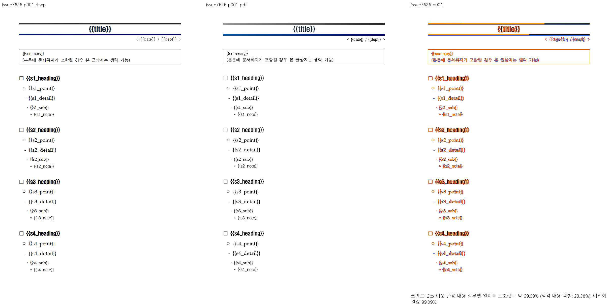
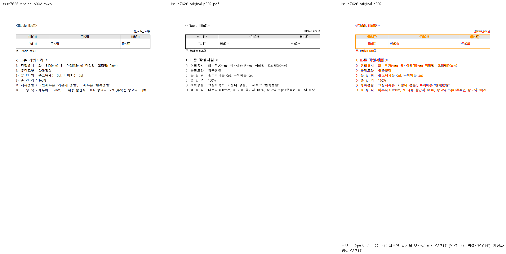
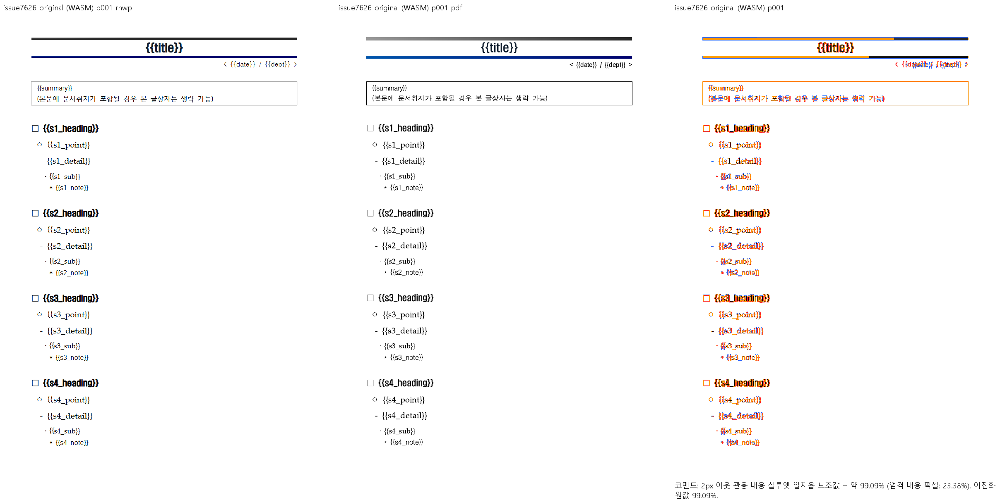

# #7626 — 미배치 줄 캐시와 문단 끝 글자 상자

[이슈 #7626](https://github.com/edwardkim/rhwp/issues/7626)의 기준 source는
`7076f836e2300f7d760d74b58c468cc0f73098a2`다. 원본·한컴 재저장 HWP·독립 Print PDF의
출처와 해시는 [재현 자료](../../../../samples/issue7626/README.md)에 고정했다.
원본의 52개 LineSeg는 모두 폭과 원점이 0인 미배치 기록이다. 한컴 PDF는 2쪽이지만
기준 Native는 1쪽이고 마지막 본문은 y=1278.4px까지 내려가 용지 밖을 넘는다.

## 원인과 공통 결과

1. 폭 0인 원본 기록은 외부 분할 줄로 분류되면서 재조판을 거절한다. 글자 크기로
   보정한 실제 줄 높이와 달리 쪽 예산은 원본의 짧은 vpos span을 재사용한다.
   `compute_render_normalized`에서 **구역 전체의 source 줄에 폭·가로 원점·세로 원점이
   모두 없는 경우**에만 파생 렌더 사본의 캐시를 제외한다. 표 셀·캡션도 같은 사본에서
   제외하고 재구성하며 원본 document/composed·저장 정보는 보존한다.
   폭만 0인 유효 높이 사다리, 구현이 생성한 줄, HWP3 저장 기하는 이 조건에 넣지 않는다.
2. 캐시 제외만 적용하면 2쪽이 되지만 최저 Sweep은 77.80%다. 표 앞 p30의 가시 글자는
   10pt이고 끝의 빈 run은 12pt다. 한컴 재저장 줄 높이 1200HU·진행 1920HU와 달리
   재조판이 1000HU·1600HU만 예약해 표와 뒤 본문이 약 4.27px 위로 당겨진다.
   `layout_paragraph_in_frame_impl`은 `ParagraphEnd`를 채운 **마지막 물리 줄에만**
   종단 CharShapeRef의 크기를 반영한다. 이 `FrameRowMetrics`에서 줄 높이·줄간격·기준선을
   함께 게시하며 텍스트 폭이나 앞선 줄은 바꾸지 않는다.

소비 경로는 `compute_render_normalized`의 파생 문단/구성 →
`layout_paragraph_in_frame_impl`의 프레임 줄 → `resolve_line_metrics`의 formatted 높이 →
HeightMeasurer·pagination의 쪽 예산 → 실제 layout의 줄/표 배치다.
원본의 미배치 높이를 이후 fit/flow에 재적용하는 대신 일반 no-cache 경로에서 같은 줄을 소비한다.
편집 후 파생 문단 갱신에도 같은 캐시 조건을 적용한다. 편집 저장본의 독립 Print 비교는 미검증이다.

## 집중 회귀

`tests/cases/issue_7626_unplaced_lineseg_pagination.rs`는 CLI의 최종 render tree를 검사한다.
원본 전체 Native/fresh WASM 최저 98.71%를 확인한 뒤 추가했다.
기대값은 원본 Print의 쪽 소속과 한컴 재저장 줄 메트릭에서 정하며 절대 표 원점이나 SVG 해시를 고정하지 않는다.

| 검사 | 기준 source CLI | 수정 CLI |
| --- | --- | --- |
| 41개 본문/표 문단의 쪽 소속·순서, 본문 내부 포함, 본문/표 token 누락·중복 | FAIL: 1쪽 | PASS: 2쪽 |
| 끝의 빈 run 줄 상자와 다음 표 진행·표 뒤 주석 관계 | FAIL: 1쪽 | PASS |
| 한컴 재저장본의 유효 줄 진행과 폭 0 표 host 보존 | PASS | PASS |

실행은 같은 정식 Rust test source를 `rustc --test`로 컴파일하고
`CARGO_BIN_EXE_rhwp`를 각각 보존한 기준 CLI와 수정 CLI로 고정했다.
기준 exit 101: 1 PASS/2 FAIL, 수정 exit 0: 3 PASS/0 FAIL이다.
파생 integration suite를 primary checkout에서 준비하거나 변경하지 않았다.
전체 Cargo integration suite·Clippy·코퍼스 래칫 및 신규 sample 보안 게이트는 아직 실행하지 않았다.

정상 대조군 8개는 동일한 `export-svg --profile print --font-style` 명령으로 전쪽 비교했다.
쪽수와 SVG가 모두 수정 전과 동일하다. 해시는 진단용 비교이며 회귀 golden으로 추가하지 않았다.

| 대조군 | 쪽수 |
| --- | ---: |
| `253E164F57A1BC6934-empty.hwp` | 2 |
| `hwp3-empty-cell.hwp` | 1 |
| `issue1639_empty_host_negative_offset_float.hwpx` | 2 |
| `issue1639_empty_host_positive_only_float.hwpx` | 2 |
| `issue1880_anchor_stack_sb_convert.hwpx` | 13 |
| `issue1880_takeplace_host_before.hwpx` | 10 |
| `basic/BlogForm_BookReview.hwp` | 1 |
| `tac-case-003.hwp` | 1 |

## 시각 검증

Windows Native debug/fresh WASM dev, print profile, Chrome webfont rasterizer,
96dpi, `--embed-fonts full --font-path C:\Windows\Fonts`로 동일 원본과 독립 PDF의 2쪽 전체를 비교한다.
검증 코드 SHA는 `95bd965c6798fffc4bde77e6cb9260c7ee803c8c`다. 이 commit 뒤 Native를
재빌드하고 WASM wrapper를 다시 실행한 뒤, commit에 포함된 원본/PDF로 두 경로 모두 재출력했다.
각 2쪽 export·render tree·PDF·raster·review·overlay가 있고 누락 쪽은 0이다.
전체 비교의 `pr_review_gate=passed`, 글꼴 예외 없음이다.

| 경로 | 1쪽 | 2쪽 | 최저 | 전쪽 TSV |
| --- | ---: | ---: | ---: | --- |
| Native debug | 99.08768% | 98.70902% | 98.70902% | [native.tsv](visual/native.tsv) |
| fresh WASM dev | 99.08768% | 98.70902% | 98.70902% | [wasm.tsv](visual/wasm.tsv) |

지표는 2px 이웃 관용 **내용 실루엣 일치율**이다. 전쪽 TSV와 대표 review 모두 90% 이상이며,
쪽수 차이·미측정·90% 미만 쪽은 없다. TSV는 위 최종 출력의 PNG pair에서 산출했고 별도 재출력으로
세지 않는다. TSV-only manifest의 `not_evaluated`를 시각 통과로 대신하지 않았다.
커밋용 TSV는 줄 끝만 LF로 정규화했다. 양쪽 TSV SHA-256은 `c9da4658bb4d18dd8d2d2c9b5bc7076f2f413c4e696b1679bc27b3897b3f14cc`이다.

두 경로의 1·2쪽 review PNG를 직접 열어 제목/요약 표, 4개 절, 다음 쪽 표/주석/작성지침의
쪽 소속·순서·누락·겹침을 확인했다. 표 괘선과 뒤 문단의 세로 위치 차이는 해소됐다.
글꼴 외형과 괘선 농도 차이는 남는다. 엄격 ink match 최저 23.383%, 평균 31.19566%이며
pixel match 최저 96.63763%다. 98.71% 실루엣 지표를 전체 픽셀의 완전 일치로 주장하지 않는다.
도구의 한글 라벨·지표는 판독 가능하다.






별도 overlay도 전쪽 보존한다:
[Native 1쪽](../../../pr/assets/issue7626-native-p001-overlay.png),
[Native 2쪽](../../../pr/assets/issue7626-native-p002-overlay.png),
[WASM 1쪽](../../../pr/assets/issue7626-wasm-p001-overlay.png),
[WASM 2쪽](../../../pr/assets/issue7626-wasm-p002-overlay.png).

소비 위치는 `queries/rendering.rs:5182`의 파생 문단 선택 → `:5235`의 측정 → `:5332`의 조판,
`composer/line_breaking.rs:3500`의 종단 크기 → `:3543`의 공통 프레임 메트릭 →
`typeset/paragraph/format.rs:55`와 `:96`의 실제 줄/fit 소비다.
유효 source 행을 보존하는 대조군에서 높이 사다리를 새 조건으로 덮어쓰지 않는 것도 확인했다.
여러 물리 줄/배제 구간의 서로 다른 종단 스타일 및 편집 저장본 Print는 실행 증거가 없어 미검증이다.

실행 명령(저장소 루트 PowerShell, Python UTF-8, Chrome 경로는 `VISUAL_SWEEP_CHROME`으로 공급):

```powershell
cargo build --locked --bin rhwp --target-dir target/pr-review
venv/Scripts/python.exe scripts/visual_sweep.py --hwp samples/issue7626/sample-document.hwpx --pdf pdf/issue7626/sample-document-hwpx-2020.pdf --key issue7626 --rhwp-bin target/pr-review/debug/rhwp.exe --dpi 96 --embed-fonts full --font-path C:\Windows\Fonts --out output/pr-review/issue7626/final-native
venv/Scripts/python.exe scripts/visual_sweep.py --hwp samples/issue7626/sample-document.hwpx --pdf pdf/issue7626/sample-document-hwpx-2020.pdf --key issue7626 --wasm-pkg pkg --rhwp-bin target/pr-review/debug/rhwp.exe --dpi 96 --embed-fonts full --font-path C:\Windows\Fonts --out output/pr-review/issue7626/final-wasm
venv/Scripts/python.exe scripts/visual_sweep.py --silhouette-only --png-pair output/pr-review/issue7626/final-native/issue7626/rhwp_png output/pr-review/issue7626/final-native/issue7626/pdf_png --key issue7626-native-final --out output/pr-review/issue7626/final-native-tsv
venv/Scripts/python.exe scripts/visual_sweep.py --silhouette-only --png-pair output/pr-review/issue7626/final-wasm/issue7626/rhwp_png output/pr-review/issue7626/final-wasm/issue7626/pdf_png --key issue7626-wasm-final --out output/pr-review/issue7626/final-wasm-tsv
```

WASM은 루트에서 Cygwin으로 `CARGO_TARGET_DIR=target/pr-review scripts/wasm-pack-locked.sh
--target web --out-dir pkg --mode no-install --dev`를 실행했다. lock의 wasm-bindgen 0.2.127과 맞는
공식 Windows CLI를 PATH에 공급했다. Native build, wrapper, 양쪽 full Sweep·TSV는 모두 exit 0이다.
최종 바이너리 SHA-256은 다음과 같다.

- Native: `47a7dc118ccf640e2f658c038958affb5ac8ba305b91840e5a7f01bd0da3d6cf`
- WASM: `63d85359b471b4ea4aa6b7a801556db1e2515f0e03d43402ff4e68b854eeb544`
- JS: `a2010ac0e7d0942838b2b9d854ae01eeee06f61ae62d35334c966a465962cab6`

`pkg/`와 `rhwp-studio/public/`의 JS·WASM SHA-256은 각각 일치한다. `public/rhwp.js`는
로컬 생성본으로 유지하고 이번 commit에는 포함하지 않는다. 공개 JS API 변경은 없다.
실행 로그·render tree·전체 폰트를 품은 SVG·manifest는 ignored output에 남기고,
사용자가 요청한 원본/HWP/PDF·최종 PNG·전쪽 TSV는 commit에 포함한다.
