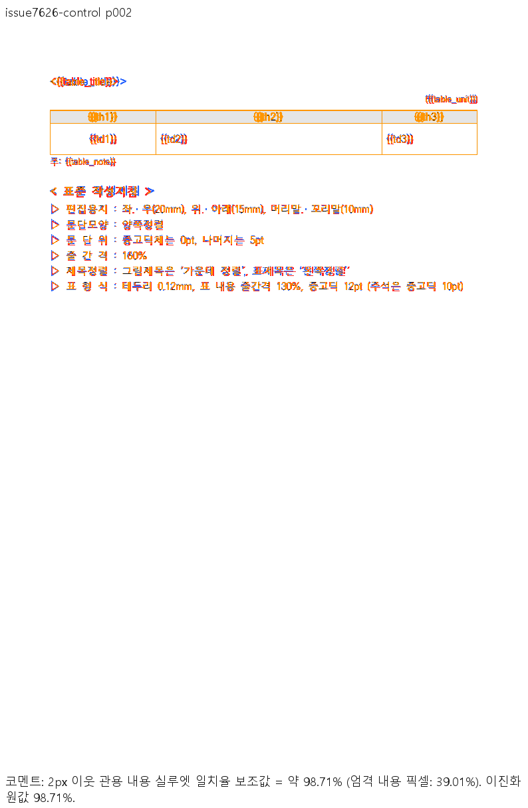
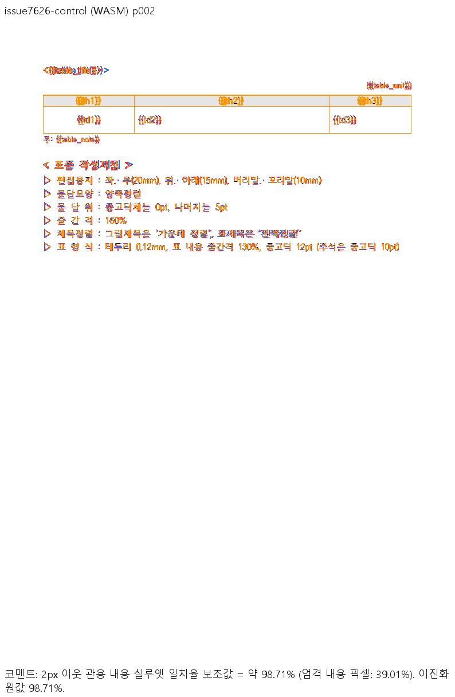
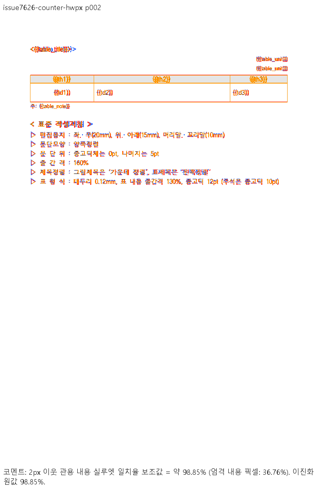
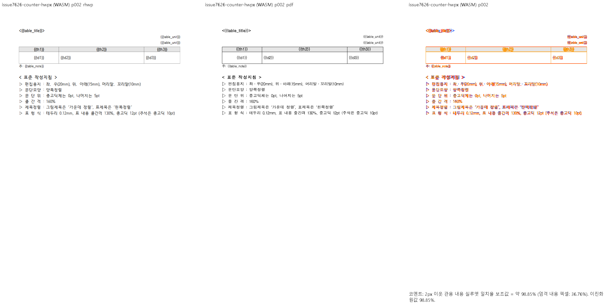
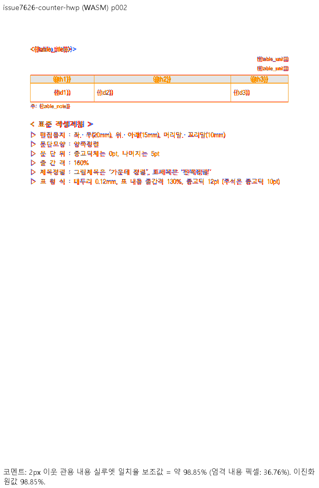

# #7626 — 미배치 줄 캐시와 문단 끝 글자 상자

[이슈 #7626](https://github.com/edwardkim/rhwp/issues/7626)의 기준 source는
`7076f836e2300f7d760d74b58c468cc0f73098a2`다. 원본·한컴 재저장 HWP·독립 Print PDF의
출처와 해시는 [재현 자료](../../../../samples/issue7626/README.md)에 고정했다.
원본의 52개 LineSeg는 모두 폭과 원점이 0인 미배치 기록이다. 한컴 PDF는 2쪽이지만
기준 Native는 1쪽이고 마지막 본문은 y=1278.4px까지 내려가 용지 밖을 넘는다.

## 원인과 공통 결과

1. 폭 0인 원본 기록은 외부 분할 줄로 분류되면서 재조판을 거절한다. 글자 크기로
   보정한 실제 줄 높이와 달리 쪽 예산은 원본의 짧은 vpos span을 재사용한다.
   `compute_render_normalized`에서 **구역 전체의 source 줄에 폭·가로 원점·세로 원점이
   모두 없는 경우**에만 파생 렌더 사본의 캐시를 제외한다. 표 셀·캡션도 같은 사본에서
   제외하고 재구성하며 원본 document/composed·저장 정보는 보존한다.
   폭만 0인 유효 높이 사다리, 구현이 생성한 줄, HWP3 저장 기하는 이 조건에 넣지 않는다.
2. 캐시 제외만 적용하면 2쪽이 되지만 최저 Sweep은 77.80%다. 표 앞 p30의 가시 글자는
   10pt이고 끝의 빈 run은 12pt다. 한컴 재저장 줄 높이 1200HU·진행 1920HU와 달리
   재조판이 1000HU·1600HU만 예약해 표와 뒤 본문이 약 4.27px 위로 당겨진다.
   `layout_paragraph_in_frame_impl`은 `ParagraphEnd`를 채운 **마지막 물리 줄에만**
   종단 CharShapeRef의 크기를 반영한다. 이 `FrameRowMetrics`에서 줄 높이·줄간격·기준선을
   함께 게시하며 텍스트 폭이나 앞선 줄은 바꾸지 않는다.

소비 경로는 `compute_render_normalized`의 파생 문단/구성 →
`layout_paragraph_in_frame_impl`의 프레임 줄 → `resolve_line_metrics`의 formatted 높이 →
TypesetEngine의 문단 쪽 예산 → 실제 layout의 줄/표 배치다.
원본의 미배치 높이를 이후 fit/flow에 재적용하는 대신 일반 no-cache 경로에서 같은 줄을 소비한다.
편집 후 파생 문단 갱신에도 같은 캐시 조건을 적용한다. 편집 저장본의 독립 Print 비교는 미검증이다.

## 집중 회귀

검증 code head는 `b79f283b614be07e32cc2657d4f72ee3d0335285`이며 정책 base는 `fe9ffd27e91d8d260fbccde5ff68aa08aadf94ca`다. 최신 devel 위로 rebase했고, 검증 전용 worktree에서 파생 suite를 준비했다.

검증 시작 후 devel이 `6ed5c0909723289749b2b757ac4f02a604608a59`로 전진했다. source를 반복 rebase하지 않았으며, 이 base의 manifest 정책 검사 exit 0과 merge-tree exit 0(`48fa755af3393c51fc55a57562f0bfb8e5ec3303`)을 따로 확인했다. 게시·후행 문서 commit 전에는 최종 base/head의 병합·링크·오늘할일 보존을 다시 확인하고 PR의 실제 merge tree CI를 기다린다.

정식 `tests/cases/issue_7626_unplaced_lineseg_pagination.rs`는 원본의 41개 본문/표 소유 순서·쪽 소속·누락/중복·본문 안 배치, 마지막 빈 run의 줄 상자·다음 표/주석 관계, 폭 0 표 host가 있는 유효 저장 높이 사다리를 검사한다. 두 줄 반례의 첫 줄 진행 1600HU와 마지막 줄 뒤 진행 1920HU도 검사한다. 합성 변형과 실제 원본의 생성 방식은 [재현 자료](../../../../samples/issue7626/README.md)에 구별했다.

| 실행 대상 | 정식 회귀 결과 | 의미 |
| --- | --- | --- |
| 수정 전 `7076f836e2300f7d760d74b58c468cc0f73098a2` CLI | 1 PASS / **2 FAIL**, exit 101 | 1쪽으로 합쳐지는 기존 결함을 검출한 음성 대조 |
| 수정본 CLI | **3 PASS / 0 FAIL**, exit 0 | 한컴 Print의 2쪽과 줄 진행/표 배치 관계 유지 |
| 최종 review worktree의 Cargo/nextest 집중 검사 | **3 PASS**, exit 0 | 파생 integration suite에서 동일 정식 source 실행 |

수정 전 FAIL은 현재 수정본의 실패가 아니다. 동일 정식 Rust source를 `rustc --test`로 빌드한 뒤 실행 파일만 각각의 CLI로 고정했다. 로그는 `output/pr-review/issue7626/focused-final-{before,after}.log`에 구분했다.

## 필수 로컬 검증

전체 nextest 최종 결과: `Summary [1391.050s] 10506 tests run: 10506 passed (12 slow), 50 skipped`. `--locked --cargo-profile release-test --target-dir target/pr-review --tests --test-threads 8 --no-fail-fast`로 실행했고 build jobs는 2다.

| 단계 | 결과 |
| --- | --- |
| `prepare` | exit 0 (9.8초) |
| `release-test-all` | exit 0 (3408.7초) |
| `fmt` | exit 0 (49.2초) |
| `clippy-native` | exit 0 (35.3초) |
| `clippy-wasm` | exit 0 (11.4초) |
| `build-workspace` | exit 0 (49.1초) |
| `clippy-workspace` | exit 0 (109.5초) |
| `manifest-base-check` | exit 0 (2.5초) |
| `focused-cargo` | exit 0 (8.1초) |
| `skia-lib` | exit 0 (1258.7초) |
| `skia-placeholder` | exit 0 (914.1초) |
| `skia-direct-pdf` | exit 0 (44.2초) |

모든 Cargo 검증은 Windows 네이티브의 공유 `target/pr-review`를 순차 사용했다. Native Skia는 lib 전체와 `issue_2225_missing_picture_placeholder`, `render_p37_direct_pdf_export` 3종이다. source-side `#[cfg(test)]` 변경은 없어 unit-tier 정책 검사는 비해당이다. integration 원본 추가의 manifest Node 계약 검사도 23/23 통과했다.

신규 sample 보안 입력은 네 문서를 `RHWP_SECURITY_SWEEP_SAMPLES_JSON`으로 명시했다. IR·cell overflow·off-canvas·text overlap·body overflow 및 oracle 쪽수는 전체 회귀에 포함했다. canonical PDF 선택기의 기존 생성 로직으로 #7626 네 행을 실제 재계산했으며 4/4가 2쪽으로 일치하고 반복 생성 SHA-256은 `2f3cebc2def07a8d7598b9dfa584512e242bca49b24e9f9b810eedf54a7184f1`이다. 다른 문서의 baseline과 허용치를 변경하지 않았다.

클리핑의 외부 controlset 92개는 primary/review worktree 모두에 없어 **미검증**이다. 실제 결과는 문서=0, ERR/없음=92, baseline누락=92이며 통과로 세지 않는다. 이번 네 입력의 fidelity 원장에는 clipping/겹침/owner 이동 후보가 없고 각 PDF·SVG·render tree의 전체 쪽수는 2다. 외부 controlset의 무회귀를 이 결과로 대신하지 않는다.

Node 24.19.0에서 이번 web package를 `init({module_or_path: bytes})`와 `HwpDocument`로 직접 실행했다. 네 입력 모두 `pageCount()=2`, print SVG와 render tree 생성에 성공했다. 배포된 npm package의 갱신을 주장하는 결과가 아니다.

## Native/fresh WASM 시각 증적

Windows Native release-test / fresh WASM release, print profile, Chrome webfont rasterizer, 96dpi, `--embed-fonts full --font-path C:\Windows\Fonts`를 사용했다. WASM은 lock의 wasm-bindgen 0.2.127에 맞춘 CLI로 루트 wrapper `scripts/wasm-pack-locked.sh --target web --out-dir pkg --mode no-install --no-opt`를 실행했다. Docker/WSL은 사용하지 않았다.

Native/WASM 빌드 당시 source는 `926b363f78c46fb6f49cf552a95666c373fa9b04`다. rebase 전후 tree가 같으며 이후 보강한 test·fixture를 제외한 `src/`, `crates/`, `vendor/`, Cargo files, build script, WASM wrapper의 내용도 최종 code head와 같다. 이 동일성을 실제 Git diff로 확인했다. 원본/HWP 대조군은 rebase 후 저장소 경로에서 다시 출력했고, 두 줄 자료는 먼저 검증한 외부 파일과 commit 파일의 SHA-256 동일성을 확인했다. 기존 캡처 재사용과 재출력을 구분한다.

| 입력 | 경로 | p1 | p2 | 최저 | gate |
| --- | --- | ---: | ---: | ---: | --- |
| original | native | 99.08768% | 98.70902% | 98.70902% | passed |
| original | wasm | 99.08768% | 98.70902% | 98.70902% | passed |
| control | native | 99.10313% | 98.70902% | 98.70902% | passed |
| control | wasm | 99.10313% | 98.70902% | 98.70902% | passed |
| counter-hwpx | native | 99.08768% | 98.85353% | 98.85353% | passed |
| counter-hwpx | wasm | 99.08768% | 98.85353% | 98.85353% | passed |
| counter-hwp | native | 99.10313% | 98.85353% | 98.85353% | passed |
| counter-hwp | wasm | 99.10313% | 98.85353% | 98.85353% | passed |

네 입력 각각 2쪽을 양 경로로 비교한 16쌍 모두 90% 이상이고 누락/미측정 쪽은 0이다. 최저값은 **98.70902%**다. 지표는 2px 이웃 관용 내용 실루엣이며 전체 픽셀 fidelity와 구분한다. 원본의 엄격 ink match 최저 23.383%, 평균 31.19566%이고 pixel match 최저 96.63763%다. 제목선의 색상·그라데이션과 글꼴 획·농도 차이가 남는다.

원본과 HWP 대조군의 p1 review, 네 입력의 양 경로 p2 review/standalone overlay를 직접 열었다. 제목/요약 상자와 4개 절의 순서, 다음 쪽의 단위 표기·표 괘선·주석·작성지침을 확인했다. 두 줄 변형의 p1 raster는 각각 대응 원본/대조군과 SHA-256이 같아 중복 입력의 p1 판독을 연결했다. p2의 줄·표·뒤 문단 경계는 Print와 일치하며 누락/겹침이 없다. 도구의 한글 라벨·지표도 판독 가능하다.

### 전쪽 TSV와 실행 provenance

TSV는 아래 최신 full Sweep의 PNG pair에서 `--silhouette-only --png-pair`로 산출했다. TSV-only의 `not_evaluated`를 full gate 통과로 세지 않았다. 중간 TSV/JSON/로그/폰트를 품은 SVG는 ignored output에 보존한다.

| 입력/경로 | full 출력 | TSV SHA-256 |
| --- | --- | --- |
| original/native | `output/pr-review/issue7626/submitted-native-original` | `73b1bcebda324052a6e3964b5520b4808cb32e9b702770cc6cd42bf4e77567e1` |
| original/wasm | `output/pr-review/issue7626/submitted-wasm-original` | `73b1bcebda324052a6e3964b5520b4808cb32e9b702770cc6cd42bf4e77567e1` |
| control/native | `output/pr-review/issue7626/submitted-native-control` | `1e3f5d4789b13730d1488cecb462941c2dba6a3f49ac23fec50456a6ae0e92f4` |
| control/wasm | `output/pr-review/issue7626/submitted-wasm-control` | `1e3f5d4789b13730d1488cecb462941c2dba6a3f49ac23fec50456a6ae0e92f4` |
| counter-hwpx/native | `output/pr-review/issue7626/pr-native-counter-hwpx` | `2b10c92d6bc42801bea001c184e97f3fd6320f50713f7d3c88ca5e84bb6d46b1` |
| counter-hwpx/wasm | `output/pr-review/issue7626/pr-wasm-counter-hwpx` | `2b10c92d6bc42801bea001c184e97f3fd6320f50713f7d3c88ca5e84bb6d46b1` |
| counter-hwp/native | `output/pr-review/issue7626/pr-native-counter-hwp` | `cf391c94b083bd3843a1b2c8828a90fad3a16136714ce12e2c9ce0de6c14c51b` |
| counter-hwp/wasm | `output/pr-review/issue7626/pr-wasm-counter-hwp` | `cf391c94b083bd3843a1b2c8828a90fad3a16136714ce12e2c9ce0de6c14c51b` |

TSV는 `output/pr-review/issue7626/submission-{native,wasm}-{original,control,counter-hwpx,counter-hwp}-scores/silhouette.tsv`에 있다. native exporter SHA-256은 `52c486ad90d63825937d8857745c43f51a7cb07c8667b078d8c5ce0dbbf33d84`, WASM은 `d7e682299e4f57953610fa0193682756929376f6215a86e1ec0b9970f00c8cf5`, JS는 `70cde06a369fa7fd4fc8bc8f3d6acaee158596ba1a116a2c72159002b0b5654e`다. `pkg/`와 Studio public의 JS·WASM 쌍이 일치한다. 공개 JS API 변경은 없다.

### 대표 경계 — 모든 입력 p2

#### original

| 경로 | review | standalone overlay |
| --- | --- | --- |
| native |  |  |
| wasm |  |  |

#### control

| 경로 | review | standalone overlay |
| --- | --- | --- |
| native |  |  |
| wasm |  |  |

#### counter-hwpx

| 경로 | review | standalone overlay |
| --- | --- | --- |
| native |  |  |
| wasm |  |  |

#### counter-hwp

| 경로 | review | standalone overlay |
| --- | --- | --- |
| native |  |  |
| wasm |  |  |

## 입력 커밋 확인과 남은 범위

실제 사용한 HWP/HWPX 4개와 Print PDF 4개는 `b79f283b614be07e32cc2657d4f72ee3d0335285`의 파일 bytes와 대조해 동일성을 확인했다. 출처·SHA-256은 [sample README](../../../../samples/issue7626/README.md)에 있다. PDF는 모두 Creator `Hwp 2020 0.0.0.0`, Producer `Hancom PDF 1.3.0.550`, PDF 1.4, 2쪽, 각 MediaBox 595×841pt다. 메타데이터의 0.0.0.0을 실제 출력 빌드로 추정하지 않고 MCP의 Hancom 2020 11.0.0.9136·전처리 없음·1-up Print 실행 기록을 근거로 삼았다.

| Print PDF | SHA-1 |
| --- | --- |
| `pdf/issue7626/end-run-two-lines-hwp-2020.pdf` | `05fdbcce71bda39f78bcdd449eec7eab640e3f67` |
| `pdf/issue7626/end-run-two-lines-hwpx-2020.pdf` | `1a07d40ee919d0681dcb75fca7430c895a7ed633` |
| `pdf/issue7626/hancom-resaved-hwp-2020.pdf` | `1b2ab2d29a0b99a084b251d62b5618d3c2623445` |
| `pdf/issue7626/sample-document-hwpx-2020.pdf` | `88a1b113c3200b62bcf0715117a75fd97015d115` |

초기 `95bd965c` 진단에서 정상 대조군 8개의 전쪽 styled SVG와 쪽수는 기준 CLI와 동일했다. 이는 그 시점의 진단이며 현재 head의 재출력으로 바꾸어 기록하지 않는다. 최종 head의 전수 무회귀는 위 전체 nextest 결과와 이번 4입력 비교로 연결한다.

구체 소비 위치는 `rendering.rs:5900`의 파생 문단 생성 → `:5183`의 문단 선택 → `:5235`의 측정 → `:5331`의 실제 조판이다. 종단 크기는 `line_breaking.rs:3500`에서 마지막 물리 줄에 반영하고 `:3543`에서 공통 프레임 메트릭을 게시한다. `typeset/paragraph/format.rs`의 줄/fit 소비와 최종 배치를 같은 Print 경계에서 검사했다.

프로덕션 문단 쪽 예산은 `typeset/section/flow.rs:122`의 format → `typeset/paragraph/format.rs:55`의 줄 높이/간격 및 `:93`의 total_height → `typeset/paragraph.rs:627`의 가용 예산·`:513`의 split entry → `:537`의 다음 단/쪽 이월이다. `HeightMeasurer`의 본문 fallback 높이는 이 경로의 입력이 아니며 `rendering.rs:5339`는 측정 결과 중 tables만 전달한다. `RHWP_USE_PAGINATOR=1` 진단/fallback은 별도 경로로 전체 Print 개선의 직접 근거로 삼지 않는다. 원본의 p27/p28 쪽 경계와 다음 표·주석·작성지침까지 정식 회귀와 전체 2쪽 Print로 확인했다. 이번 diff는 저장 캐시 수용과 frame 종단 메트릭을 바꾸며 rowspan/clipping/continuation의 내용 컷 알고리즘 자체를 바꾸지 않는다. 이들 별도 컷 경계의 신규 보정을 주장하지 않는다.

줄 조각은 `typeset/paragraph.rs:101`의 물리 예산 → `:109`의 scan과 `:122`의 컷 보정 → `:142`의 fragment 계획 → `:161`의 실제 예약/배치로 이어진다. 계획 실패는 `:156`에서 쪽을 넘겨 같은 cursor를 다시 검사하고, 마지막 줄을 소비하면 `:163`에서 끝내며 남은 줄만 `:167`에서 이월한다. 원본 p27/p28 전체 소유 순서와 반례의 두 줄/표/주석 검사로 이 변경의 사용 경계를 연결한다.

실물 원본의 열기·쪽 나눔과 같은 조건의 마지막 물리 줄 반례를 해결 범위로 삼는다. 편집 저장본의 독립 Print, 배제 구간의 서로 다른 종단 스타일, macOS 실제 한컴 출력 재생성은 미검증이다. 파생 렌더 사본만 바꾸며 저장 원본 캐시를 고치지 않는다. 외부 clipping controlset 미검증과 글꼴/제목선 residual도 위 결과와 구분한다.
