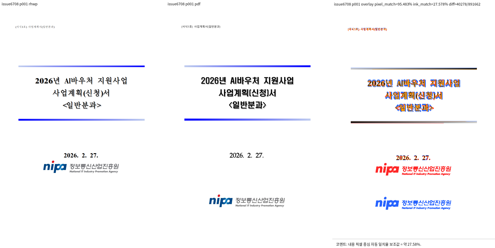
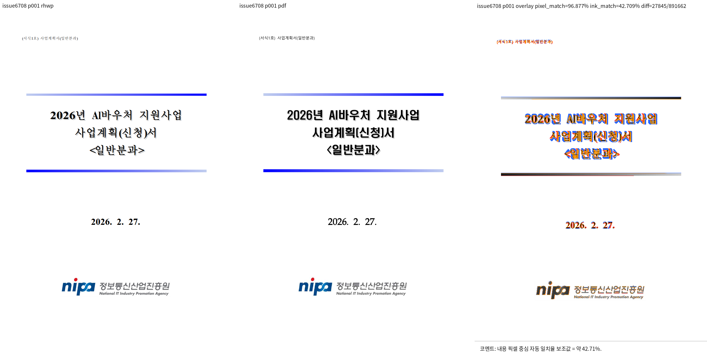

# 열린 이슈 재검증 6단계: 셀 안 그림의 줄 내 위치

Issue: #6708, 상위 원장 #6662.

## 시작 상태

- 후보 HEAD는 `67d834d8d`이며 앞선 단계의 수정과 검증 기록을 보존한다.
- #6708 본문과 정정 댓글을 다시 읽었다. 표 셀, 글상자, 본문의 서로 다른 경로에
  경험적인 같은 비례항을 넣어서는 안 된다.
- 대상은 `samples/tac-img-02.hwp` 1쪽과 `pdf/tac-img-02-2022.pdf`다.
  저장 LINE_SEG 높이 19800 HU, 기준선 16830 HU, 그림 높이 5102 HU다.
- 셀의 fallback 그림 배치는 저장 줄의 시작점만 사용한다. 기준선과 실제 그림의
  내부 좌표 및 원문 글자 모양을 조사해 잔차까지 설명한 다음 수정한다.

## 수행 및 종료 조건

1. 원문 IR, PDF 그림 box, 줄 내 기준선 계산의 소유 경로를 확인한다.
2. 원인을 구분하는 실패 계약을 `tests/cases/`에 만든다. 기존 정상 그림도 대조한다.
3. 좁은 범위로 수정하고 집중 계약과 대상 시각 비교를 실행한다.
4. 실제 실행 결과와 남은 조건을 이 문서에 기록하고 일반 커밋으로 고정한다.
5. 원장에 있는 나머지 이슈도 단계별로 이어간다. 모든 이슈 완료 전 일괄 종료하지 않는다.

로그 및 중간 SVG/PNG/JSON은 `/tmp`에서만 사용한다. 코멘트에 직접 사용할 최종
비교 이미지만 저장소에 보존한다. 전체 회귀와 PR 제출 검증은 아직 완료하지 않았다.

## 분석 및 수정 결과

- 원문 그림의 높이는 68.0267px인데 저장 text box는 264px, baseline은 224.4px다.
  fallback은 그림을 글줄 맨 위에 놓았다. 그림 자체의 baseline을 같은 비율로 계산하여
  `stored_baseline * max(0, 1 - picture_height / stored_text_height)`만큼 내려야 한다.
- 경험적인 상수나 파일명 분기를 넣지 않았다. 합성 줄, 무효 기준선, 캡션 또는 세로
  바깥 여백이 있는 그림은 보정을 적용하지 않는다. 그림이 text box를 채우면 이동량은 0이다.
  같은 줄의 그림마다 로컬 y를 계산하므로 여러 그림에서 이동량이 누적되지 않는다.
- 독립 대조: 원본 표지의 글자 크기 및 저장 줄 메트릭만 19800/10000/6000 HU로 바꾼
  3개 구역 문서를 한컴으로 변환했다. MCP 요청 엔진은 2020, 응답 runtime은
  `12.0.0.4605`, 완료 13.668초, 3쪽이다. 원문 PDF와 별개인 통제 실험이다.
  그림 y는 각각 687.21/652.9275/638.9025pt였고 새 계약이 모두 일치한다.
- PDF MediaBox 높이 841pt를 SVG 실제 용지 높이에 정규화했다. 무조건 96/72를 곱해
  반올림된 PDF 용지와 HWP A4를 동일시하지 않는다. 기존 9px 잔차 추정 대신
  그림 자체의 baseline을 포함한 계산으로 원인별 검증이 가능해졌다.

## 검증

- 수정 전 신규 계약 2건: 0 passed, 2 failed. 초기 test helper의 i32 타입 오류는
  별도로 수정한 뒤 실제 런타임 실패를 확인했다.
- 수정 후 `issue_6708_cell_picture_baseline`: 5 passed / 0 failed (0.451초).
- 기존 `issue_1139`, `issue_6122`, `issue_6313`, `issue_6630`: 91 passed / 0 failed
  (2.889초). 중복 그림, 줄바꿈, 표지 여백 및 기존 그림 위치 핀을 유지했다.
- `visual_sweep.py --hwp samples/tac-img-02.hwp --pdf pdf/tac-img-02-2022.pdf
  --key issue6708 --page 1 --rhwp-bin target/pr-review/release-test/rhwp`로 전후 비교했다.
  Linux에서는 `VISUAL_SWEEP_CHROME`에 설치된 Playwright Chromium 경로를 지정했다.
- 페이지 66/66 유지. 대상 그림 x/y 차이는 -0.02/-0.03px이며 수정 전 y=-166.63px다.
  글꼴 및 제목 glyph 차이는 별개이며 전체 문서 픽셀 일치로 과장하지 않는다.
- 전후 sweep 모두 exit 0. 비교 PNG를 직접 판독해 하단 로고의 이동을 확인했다.
  `cargo fmt --all -- --check`도 exit 0이다.

## 코멘트 계획

#6708 및 병합 PR 코멘트에는 아래 두 파일을 실제 이미지로 삽입한다. 게시할 때
`raw.githubusercontent.com/edwardkim/rhwp/<증적 커밋 SHA>/mydocs/pr/assets/...`의
고정 주소를 사용한다. 그림 y 오차 166.63 -> 0.03px, 집중 계약 96건 통과를 함께 적되
전체 회귀는 최종 후보에서 다시 확인한 결과만 쓴다. 현재는 아직 게시하지 않았다.

| 입력 | SHA-256 |
|---|---|
| `samples/tac-img-02.hwp` | `f8d5b42367363de0bfde553c062e8a632c222e076a52c95b36efb490b743008e` |
| `pdf/tac-img-02-2022.pdf` | `f52adaf3a4268be5075cf20359f085d91e08addcc4d672999a9b8fef5336fc01` |
| 검증 CLI | `a76df2f5df98bea8d69b67c01673c74fea295c0ac004f6a9718e358fa74cc100` |
| 통제 실험 PDF (임시) | `d44953ed0e0fa33f4e2eb6bd56ce08f0bba243580dba8ca53d9d2d2c0c5d49a0` |

## 전체 검증과 다음 단계

이번 수정 **전** HEAD `67d834d8d`의 전체 nextest: 9074건 중 9070 passed,
4 failed, 46 skipped, 414.225초, exit 100. 실패는 #6712 한국어/중국어 각 문서의
overflow-cell 및 off-canvas 게이트다. 쪽수 2쪽으로의 개선만으로 종료할 수 없으며,
한국어 예방수칙 4줄과 중국어 2줄의 용지 밖 배치를 직접 확인했다.

이 단계 커밋 후 다음 단계에서 측정·셀 분할의 빈 어울림 줄 압축과 실제 렌더 흐름이
일치하지 않는 지점을 수정한다. baseline을 완화하지 않는다. 전체 회귀 재실행 및 세
Clippy 게이트 완료 전 PR 제출/이슈 일괄 종료는 하지 않는다.
