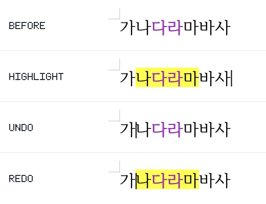
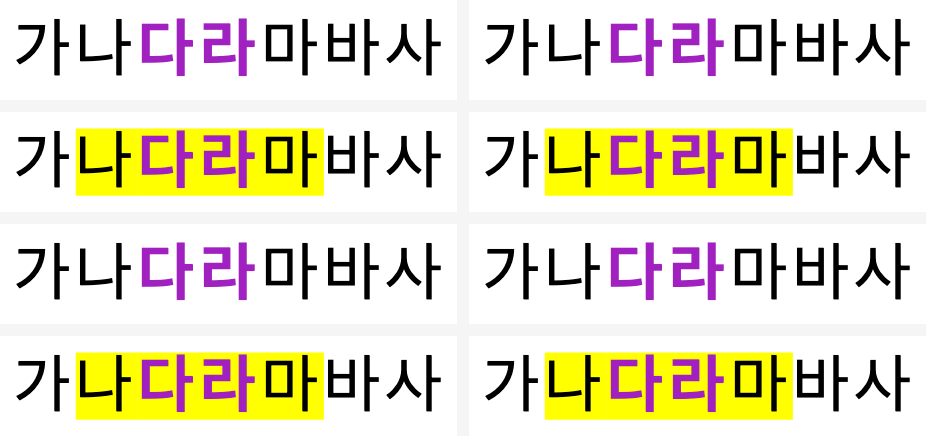

# Task M100 #6788 — 3단계 제품 검증 완료보고서

- Issue: [#6788](https://github.com/edwardkim/rhwp/issues/6788)
- 작성일: 2026-09-06
- 상태: **Chrome·Firefox 직접 UI 및 저장 후 재열기 검증 완료 — PR #6814 생성, 최신 CI·merge 승인 대기**
- 계획: [수행계획서](../plans/task_m100_6788.md), [구현계획서](../plans/task_m100_6788_impl.md)
- 이전 결과: [2단계](task_m100_6788_stage2.md)
- 검증 source: `ff716d797dedb60ee8db236b28428be88089af9f` + 아래 가드 분류 보완.
- 기준 devel: `51ad998e33ef7f5191b0e1b0b656dc44cef33a1c`

## 최종 판정 및 승인 범위

로컬 Studio에서 Chrome·Firefox 각각 새 문서 작성부터 전체/부분 형광펜 적용 → Undo → Redo를
직접 검증했다. 사용자가 각 브라우저에서 저장한 HWP·HWPX 네 파일을 에이전트가 해당 브라우저의
파일 열기로 다시 열어 보라색과 형광펜 보존을 확인했다. 저장 파일의 문자별 색상 데이터도 일치한다.
최신 직접 UI 증적과 최종 결과는 **9절**이다. 2–8절의 대기·제약은 추가 검증 이전의 경과 기록이며,
현재 Firefox UI 및 네 파일 재열기 완료 상태를 대체하지 않는다. 최적화 배포본 검증은 별도다.

최종 결과: [최종보고서](../report/task_m100_6788_report.md).

## 1. 완료된 검증

별도 review worktree `/private/tmp/rhwp-highlight-analysis.KTpzss/devel`에서
원본 source 일치를 확인하고 파생 suite를 준비했다. Cargo 검증은 공통
`/Users/melee/Documents/projects/forks/rhwp/target/pr-review`를 사용해 순차 실행했다.

| 검증 | 결과 |
| --- | --- |
| `cargo fmt --all` 및 `--check` | 통과. |
| native / WASM lib / workspace all-targets Clippy `-D warnings` | 세 단계 모두 통과. |
| `cargo build --locked --workspace` | 통과. |
| review test manifest `--check` | 통과: 1170 sources, 4940 static test attrs, 48/48 targets. |
| Studio 전체 `npm test` | **1427 passed, 0 failed, 0 skipped**. |
| manifest 및 frontend WASM binding 계약 | **22 passed, 0 failed, 0 skipped**. |
| Studio `npm run build` | TypeScript·Vite·PWA 통과. chunk 크기 경고만 있음. |
| Firefox `npm ci` 및 `npm run build` | 통과. 최초 미설치 의존성을 lockfile 기반 설치 후 빌드. |
| 전체 Rust nextest 재실행 | **9071 passed, 0 failed, 46 skipped**, 178.932초. slow 2건, leaky 1건은 별도 기재. |
| Native Skia lib | rhwp **3930 passed, 13 ignored**; workspace member 15 + 165 + 2 passed, 실패 0개. |
| Native Skia missing-picture placeholder | **2 passed**, 필터 제외 162개. |
| Native Skia direct PDF export | **4 passed**, 필터 제외 191개. |
| `git diff --check` | 통과. |

binding 계약 최초 실행은 오래된 `pkg`에서 export 8개가 없어 1개 실패했다. 아래 web WASM
재빌드 후 22개 전부 통과했다. Firefox 최초 빌드는 의존성 미설치로 실패했으며 `npm ci` 후
통과했다. 이 두 초기 실패를 숨기거나 성공 실행에 합산하지 않는다.

## 2. 산출물과 환경 한계

Docker CLI는 있으나 daemon에 연결할 수 없어 표준 Docker 최적화 빌드는 수행하지 못했다.
동일 source의 review worktree에서 locked wrapper의 `--target web --no-opt` 진단 빌드로
root `pkg`를 갱신하고 Studio와 Firefox 확장을 빌드했다. 최적화된 배포 산출물 검증으로
간주하지 않는다.

- web 및 Firefox 패키지 WASM SHA-256:
  `ed080899b874b47c50727f2beffcad4b584e52c7a6d44f709e9f6313e7e8e336`.
- 위 해시는 2단계 Node WASM과도 동일하다.
- Firefox 버전: 155.0. 기존 rhwp 배포 확장이 설치되어 있고 임시 확장은 없음을 확인했다.
- Computer Use 규칙에 따라 임시 확장 로드 직전 승인을 요청했다. 기존 배포 확장이 세션 동안
  대체될 수 있고 기존 manifest의 사이트·다운로드 접근 권한을 사용함을 고지했다.
- 사용자 Firefox 조작이 감지되어 UI 자동 조작을 중지했다. 로컬 Studio 페이지 탐색·확장
  임시 로드·형광펜 UI 재현·화면 증적은 아직 완료하지 않았다.

## 3. 자동 검증 보완과 당시 남은 게이트

전체 nextest 최초 결과는 9,071개 실행, **9,070 passed, 1 failed, 46 skipped**였다.
실패는 `issue_2724_passthrough_invalidation_guard::classification_drift_is_blocked`로,
새 `get_char_shape_runs_in_cell_by_path_native`가 미분류된 것을 검출했다. 해당 함수와
셀 접근자 호출 경로를 확인한 결과 가변 참조를 얻을 뿐 문서 IR을 바꾸지 않고 구간 검증·직렬화만
수행한다. 기존 `get_cell_char_properties_at_by_path`와 같은 `SessionState` 분류 및
구체적 근거를 가드 원본 `tests/issue_2724_passthrough_invalidation_guard.rs`에 추가했다.
제품 Rust/WASM source는 바꾸지 않았다. 가드 focused 재실행은 **5 passed**, 필터 제외
145개였다. 이 변경 후 필수 lint 3종·workspace build는 다시 통과했다. 원본 크기 변경으로
suite 자동 배정이 달라져 첫 manifest 검사에서 drift가 검출됐다. review worktree에서만
`--prepare` 후 포맷·lint·build·manifest를 다시 통과했고 전체 회귀도 **9071개 통과**했다.
`issue_2007_single_cell_continuation_does_not_repaint_boundary_fragments`는 nextest의
`LEAK` 표시가 있었으므로 경고 없는 실행이라고 주장하지 않는다. 테스트 결과는 성공이지만
종료 시 출력 핸들/자식 프로세스 잔류 원인은 이 단계에서 확정하지 않았다.

1. 승인 후 실제 Firefox 확장 UI에서 적용 → Undo → Redo → 저장·재열기와 화면 증적.
2. 결과에 따른 최종 보고 및 PR 본문 초안 준비.

자동 검증 프로세스와 사용하지 않는 Studio preview 서버는 모두 종료됐다. 사용자 브라우저의
기존 확장·문서는 변경하지 않았다. 이 단계 변경은 가드 분류와 계획/진행 보고이며 UI 검증이
남아 있어 아직 단계 완료 커밋이나 최종 완료보고서를 만들지 않았다.

## 4. 사용자 확인 및 추가 브라우저 검증

사용자는 로컬 Studio에서 테스트한 뒤 “문제가 없어”라고 확인했다. 확장을 교체하지 않는
방침을 유지하고, 추가 Firefox·Chrome 검증을 요청했다. 사용자 확인을 에이전트의 Firefox
직접 검증 결과와 혼동하지 않는다.

Chrome 전용 연결로 새 `http://127.0.0.1:7718/` 탭을 만들고 합성 한글 문구의 검정/보라
혼합 색과 일부 굵기를 준비했다. 실제 형광펜 팔레트에서 노랑을 선택하여 다음을 화면으로
확인했다.

- 전체 선택 적용 → Undo → Redo: 보라 글자색과 굵기 유지, 음영만 제거/복원.
- 서식 경계를 가로지르는 부분 선택 적용 → Undo → Redo: 선택 밖 무변경과 혼합 서식 유지.
- HWPX 저장 메뉴에서 `rhwp-6788-chrome-highlight-check`라는 별도 합성 문서명으로 저장을 요청.
  재열기 검증은 아직 하지 않았다.

Firefox는 Computer Use의 최초 상태 조회가 기존 로그인 탭의 사적 내용을 포함할 위험으로
자동 안전 검토에서 거절됐다. 거절을 우회하지 않고 Firefox 직접 검증은 보류했다. Chrome은
다른 탭을 조회하지 않는 전용 새 탭에서만 진행했다. 브라우저 확장은 교체하거나 설치하지 않았다.

당시에는 3단계 완료 판정을 보류했다. remote push·PR 생성·merge·이슈 종료는 하지 않았다.
사용자가 Firefox 조회·조작과 저장 후 재열기를 승인한 뒤 다시 시도했으나, Firefox 새 탭 이동/
상태 조회는 다른 로그인 탭 노출 위험으로 자동 안전 검토에서 다시 거절됐다. 이를 우회하지 않았다.
Chrome 전체 다운로드 목록 조회 역시 범위 밖 사적 파일명 노출 위험으로 거절되어 실행하지 않았다.
합성 문서의 알려진 이름만 Downloads 및 임시 폴더에서 확인했으나 파일을 찾지 못했다.
새 이름 `rhwp-6788-chrome-reopen-2`로 저장을 요청하고 해당 탭의 download 이벤트만 기다린
결과 15초 timeout이었다. 콘솔 error/warn은 없었다. 소스상 Chrome은 `showSaveFilePicker`
경로를 사용하며, 현재 Chrome 탭 전용 도구에는 OS 저장 창을 조작하는 기능이 없다.
따라서 **UI 저장 완료·재열기 완료로 판정하지 않으며**, 사용자에게 저장 창 완료와 파일 경로를
요청한다. 기존 Node/Rust 저장 왕복 성공과 이번 실제 브라우저 UI 미완료는 구분한다.
로그는 `/private/tmp/rhwp-highlight-analysis.KTpzss/stage3-*.log`에 로컬 보관한다.

## 5. CLI 분리 검증 및 사용자 확인용 산출물

사용자 승인에 따라 UI 제어와 저장 파일 검증을 분리했다. 새 합성 문구 `가나다라마바사`
(24pt, `다라` 보라색·굵게)에 실제 Studio ApplyCharFormatCommand/CommandHistory를
연결해 `나다라마` 부분 형광펜을 적용했다. 적용 전/적용/Undo/Redo를 HWP·HWPX로
각각 저장하고, CLI `convert`/`export-hwpx`의 `--verify --verify-pages --json`으로 재저장했다.
**8개 모두 IR diffCount 0, 페이지 1→1**이며, CLI 최종 산출물을 Node WASM으로 다시 읽어
모든 7글자의 textColor/shadeColor/bold/fontSize/fontFamily 기대값 일치를 확인했다.
동일 세션 Undo/Redo의 전체 속성·ID도 원래 before/after 상태와 일치했다.

최초 HWPX export에서 전체 속성 비교는 fillType/patternColor/patternType 차이로 실패했다.
적용 전부터 모든 상태에 관찰되므로 이 사실을 별도 기록하고, 이슈 대상 속성 비교와
전체 속성 무손실 주장을 구분한다. 해당 차이를 제품 수정하거나 숨기지 않았다.

산출물·재현 스크립트·기대값은 `/private/tmp/rhwp-6788-roundtrip.LxKSb9`에 있다.
적용/Undo HWPX의 CLI SVG 렌더도 각 1페이지, overflowCellLines 0으로 생성됐다.
브라우저 UI 저장 버튼 검증이 아니라 **실제 Studio history + 엔진 export + CLI 재저장 검증**이다.
사용자가 Firefox/Chrome에서 최종 파일을 직접 열어 확인할 수 있도록 4상태 × 2포맷을 전달한다.

## 6. Chrome 재열린 문서 직접 UI 검증

사용자가 `03-undo-cli.hwpx`를 열어둔 Chrome 로컬 Studio 탭을 전용 도구로 인수했다.
상태바 파일명과 실제 화면에서 24pt 문구·보라색 `다라`·음영 없음이 기대값과 일치했다.
재열린 문서의 `나다라마`를 직접 선택하여 노란 형광펜 적용 → Undo → Redo를 실행하고
각 화면을 확인했다. 보라색 유지, 선택 밖 `가`/`바사` 무변경, 음영만 제거·복원 모두 정상이다.
마지막에 다시 Undo하여 열었을 때의 문서 내용으로 복원했고 파일을 덮어쓰지 않았다.

8개 파일 전수 UI 재열기를 시도했지만 Chrome 파일 선택 이벤트가 timeout되어 실제 새 파일
선택까지 도달하지 못했다. 따라서 직접 확인한 UI 범위는 **사용자가 재열어둔 Undo HWPX의
화면 및 그 문서의 재편집·Undo/Redo**이며, 8개 파일 전수 UI 재열기라고 주장하지 않는다.

## 7. 8개 파일 전수 PNG 검증

`target/pr-review/release-test/rhwp export-png`의 native-skia backend,
`--profile screen --scale 2`로 CLI 최종 파일 4상태 × 2포맷을 전수 렌더링했다.
8개 모두 1페이지, 1588×2245 PNG 생성에 성공했다. 최초 `--json` 추가 실행은 해당 명령의
미지원 옵션으로 exit 2였고, 옵션 제거 후 8개 모두 exit 0으로 완료했다.

전체 페이지 RGBA 픽셀을 정확 비교한 결과:

- HWP 및 HWPX 각각 before↔undo, highlight↔redo: **차이 0픽셀** (4쌍).
- 동일 상태 HWP↔HWPX: **차이 0픽셀** (4쌍).
- 8개 이미지의 비백색 영역 전체를 포함한 공통 crop contact sheet를 직접 열어 확인했다.
  모든 행에서 `다라` 보라색·굵기가 유지되며, 적용/Redo에서만 `나다라마`에 노란 음영이 있다.

증적: `/private/tmp/rhwp-6788-roundtrip.LxKSb9/png-contact-sheet.png`
(왼쪽 HWP/오른쪽 HWPX, 위에서 before/highlight/undo/redo),
`png-checks.json`, `compare-png.mjs`, `png/` 원본 8개.
이 결과로 **전달한 8개 파일의 native PNG 재열기·시각 검증은 완료**했다.
브라우저의 webfont와 native 시스템 fallback은 글꼴 모양이 다를 수 있으며, 본 결과를
8개 파일의 브라우저 UI 전수 열기나 한컴 독립 정답지 일치로 확대 해석하지 않는다.

## 8. PR용 최종 대표 증적과 인계

2026-09-06 Chrome에서 사용자가 재열어둔 `03-undo-cli.hwpx`의 적용 전 → 부분 형광펜 →
Undo → Redo를 다시 실행·캡처했다. 원본 화면의 본문 영역을 잘라 네 행으로 배치하고 바깥에
영문 상태 라벨만 추가했다. 제품 본문 픽셀을 합성하거나 색을 수정하지 않았다. 도구가 반환한
JPEG를 PNG로 변환한 화면이므로 이 이미지에는 픽셀 동일성 수치를 적용하지 않는다.
마지막 Undo로 최초 내용에 복원했고 저장 파일은 덮어쓰지 않았다.

아래는 브라우저 캡처가 아닌 **native-skia CLI 렌더링**이다. 왼쪽 HWP, 오른쪽 HWPX;
위에서 적용 전·형광펜·Undo·Redo. 7절의 0픽셀 차이는 이 PNG들의 전체 페이지 비교 결과다.

- Chrome 원본 캡처·패널 생성기: `/private/tmp/rhwp-6788-pr-screenshots.ejW3ep`.
- 최종 대표 이미지: `mydocs/pr/assets/issue6788_chrome_behavior.png`,
  `mydocs/pr/assets/issue6788_cli_roundtrip.png`. PR 본문에서 두 파일만 직접 표시한다.
- 대표 이미지 SHA-256 (Chrome / CLI):
  `bf21ba2a3a6502eeb640e1b572da886c60f496944e25de59af5e5912d4e954b6` /
  `7566cbaeba0f24cf322a24f3ed6aeafe7ce524df8d1d0694ba297fd0209f1e22`.
- 원시 화면·8개 전체 PNG·JSON·실행 로그는 임시 경로에 두고 커밋하지 않는다.
- 로컬 Studio `http://127.0.0.1:7718/`는 사용자 추가 확인을 위해 유지한다.
- 이후 별도 승인 시 upstream 작업 branch push → `devel` 대상 Open PR 생성 → 실제 PR 번호에
  맞춘 archive self-review 기록 → 최신 head CI·merge 승인 순서다. 아직 원격 작업은 하지 않았다.

## 9. Chrome·Firefox 새 문서부터 직접 UI 재검증 및 실제 저장본 재열기

2026-09-06 사용자는 CLI 대안 중심의 복잡한 PR 설명 대신 두 브라우저를 직접 조작하는 검증을
요청했다. Computer Use로 `http://127.0.0.1:7718/`의 새 문서에서 각각 `가나다라마바사`를 입력하고,
24pt와 `다라`의 보라색 `#a020c0`을 실제 글자색 선택기로 지정했다. CLI 파일을 초기 문서로 쓰지 않았다.
각 브라우저에서 전체 선택과 부분 선택 `나다라마`의 노란 형광펜 적용 → Undo → Redo를 확인했다.
보라색과 기존 굵기가 유지되며 부분 선택 밖 `가`·`바사`는 변하지 않았다.

사용자가 각 브라우저의 부분 형광펜 Redo 상태를 HWP·HWPX로 다운로드 폴더에 저장했다.
에이전트가 실제 파일 열기 메뉴와 OS 파일 선택 창을 조작하여 아래 네 파일을 원래 브라우저에서
각각 다시 열었다. 파일명·로딩 완료 상태와 본문 화면을 확인했고, 기존 파일은 덮어쓰지 않았다.

| 브라우저 | 파일 | 재열기 | SHA-256 |
| --- | --- | --- | --- |
| Chrome | `rhwp-6788-chrome-highlight.hwp` | 정상 | `1594a26b2bbedf35fccd46f259807d59d1b5a718ca1d99c2a115bda07589d740` |
| Chrome | `rhwp-6788-chrome-highlight.hwpx` | 정상 | `02535f621a54ff2b620a49b31938133bd628de40bd308b1a2ab6802583772a90` |
| Firefox | `rhwp-6788-firefox-highlight.hwp` | 정상 | `a96a644d6359ec5b476ece8cbaf26411340cfc551c8364daa5de9032c965f685` |
| Firefox | `rhwp-6788-firefox-highlight.hwpx` | 정상 | `3f626ebd9a5fe0117db4b115ee8e9a0ada6027da43901f5b168291e3b4bf3d18` |

네 파일을 `pkg-node/rhwp.js`의 `HwpDocument`로 읽어 `getCharPropertiesAt(0, 0, i)`를
7글자 전체에 적용했다. `textColor`는 `다라`만 `#a020c0`, 나머지는 `#000000`;
`shadeColor`는 `나다라마`만 `#ffff00`, 나머지는 `#ffffff`임을 assertion으로 확인했다.
Chrome의 굵기는 `다라`, Firefox의 굵기는 `다라마바사`에 설정돼 있어 두 UI 문서를 동일한
굵기 fixture로 취급하지 않는다. 각 브라우저 안에서 해당 굵기가 HWP·HWPX 모두 보존된다.

Firefox 재열기 전체 화면에서 글자가 검정으로 보인다는 잠정 관찰은 문서 영역 crop을 확대해
직접 확인한 뒤 판독 오류로 정정했다. 보라색이 실제 화면에도 남아 있으며 저장 데이터·도구 모음의
색상 값과 일치한다. 별도 제품 결함으로 분류하거나 코드 변경을 하지 않았다.

원시 UI 증적과 패널 생성기는 `/private/tmp/rhwp-6788-browser-ui.QeG9sh`에 보관한다.
공개 패널은 원본 JPEG의 문서 영역을 PNG로 변환·crop하여 배치하고 바깥 라벨만 추가했다.
본문의 색상·글자 픽셀은 수정하지 않았으며 브라우저 북마크·프로필 영역은 포함하지 않았다.
Firefox의 추가 전체 화면 조회는 작업 외 정보 노출 위험으로 안전 검토에서 거절되어 중단했다.
최종 판정에는 이미 확보한 재열기 화면의 문서 영역과 저장 파일의 읽기 전용 검사를 사용했다.

이번 추가 검증은 문서·이미지 증적만 변경한다. 1절의 제품 소스 검증 결과는 유지하며,
PR 본문 대표 이미지는 이 절의 두 패널로 교체한다. 원격 push·PR 생성은 아직 수행하지 않았다.

## 10. PR 제출

9절까지의 검증과 간결한 PR 초안 공유 후 사용자의 “진행해줘”로 push·PR 생성을 승인받았다.
`4936663ea4b6019ddc83c0ca0fafe41a0bae3058`을 upstream 작업 branch로 push하고
[Open PR #6814](https://github.com/edwardkim/rhwp/pull/6814)를 `devel` 대상으로 생성했다.
최신 devel과의 merge simulation·diff check·문서 7개 링크 검사, 검증 이후 코드 무변경을 확인했다.
본문의 한글과 SHA 고정 이미지 blob도 게시 후 재조회했다.
[self-review](../pr/archives/pr_6814_review.md)는 같은 branch의 후속 기록이다.
GitHub Actions는 진행 중이며 merge·GitHub approve·issue close는 수행하지 않았다.
