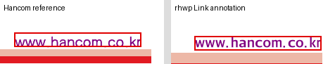
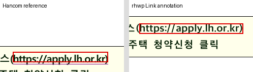

# 단계 3 — 페이지 링크 영역과 PDF 주석 보존

- Issue: [#6963](https://github.com/edwardkim/rhwp/issues/6963)
- 실행일: 2026-09-10
- 기준: 단계 2 커밋 `8e90b67ea`
- 상태: native SVG/Skia PDF 출력 구현 및 focused 검증 완료. Studio 연결은 단계 4.

## 변경 내용

`DocumentCore::page_hyperlinks_native`는 출력 `PageLayerTree`의 실제 TextRun과
필드 범위를 교차해 페이지별 링크 영역을 반환한다. 문자 수 비례 계산 대신 renderer가
사용하는 문자 경계를 사용하며, 표·글상자의 중첩 cell_path와 상위 clip을 적용한다.
줄·페이지·서식 run이 나뉘면 각각의 영역을 반환한다. GlyphRun sidecar는 중복 집계하지 않는다.

PDF 출력은 그림과 링크 영역에 같은 레이어 트리를 사용한다. SVG-derived PDF에는
`/Link`·`/URI` 주석을 추가하고 CSS px 좌상단 좌표를 PDF point 좌하단 좌표로 변환한다.
페이지 변환 실패 시 원래 입력 인덱스를 유지하므로 뒤 페이지의 링크가 앞 페이지에 붙지 않는다.
Direct/Skia PDF에도 같은 영역의 URL annotation을 추가한다. 기존 저수준 PDF API는
빈 링크 목록을 넘기는 호환 wrapper로 유지했다.

HTTP/HTTPS와 기존 mailto 주소만 내보낸다. 한컴 Command escape는 단계 2의 공통
decoder로 해제하고, 비ASCII UTF-8 바이트와 공백은 URI percent encoding으로 출력한다.
Print/HighQuality SVG에도 투명 링크 영역을 넣었다. 이 SVG anchor의 존재는 실제
브라우저 PDF 저장에서 링크가 보존된다는 증거가 아니며, 단계 5에서 별도로 검증한다.

지원 범위는 HWP5/HWPX의 가로쓰기 본문·표 셀·글상자 텍스트 필드다. 머리말·꼬리말·
바탕쪽·각주·캡션·HWP3·내부 GoTo는 이번 범위에 포함하지 않는다. 보이는 URI 링크가
회전·세로쓰기·글자 겹침 또는 표시 문자열 길이 변경을 사용하면 명시적 오류를 반환한다.

## 검증 결과

회귀 원본: `tests/cases/issue_6963_hyperlink_pdf.rs`.
파생 suite는 별도 review worktree에서만 준비했으며 커밋하지 않는다.

- 기본 feature **8/8**, `native-skia` feature **9/9** 통과.
- 기존 #3773 SVG→PDF 페이지 실패 격리 회귀 **5/5** 통과.
- native/WASM/Skia library Clippy와 `native-skia` integration suite Clippy의
  `-D warnings` 통과. 전체 fmt 및 파생 manifest check 통과.
- 서로 다른 문자 폭·이모지 선택 범위, clip, 페이지 분할, 잘못된 scheme과 배열 길이,
  PDF 좌표 변환, Unicode URI, 변환 실패 페이지의 링크 귀속을 검사했다.
- 실제 긴 문단의 마지막·첫째·마지막 페이지 재배열 출력에서 페이지별 링크 수
  `33, 41, 33`을 확인했다.
- 실제 CLI로 Textmail을 `--profile print --backend svg`와 `--backend direct`로
  출력하고 pypdf로 다시 읽었다. 두 파일 모두 `/URI` 링크 1개와 원본 주소를 보존했다.

재실행 명령(review worktree):

```bash
node scripts/rust-test-suite-manifest.mjs --prepare
node scripts/run-rust-test.mjs --cargo-test issue_6963_hyperlink_pdf -- -p rhwp --target-dir target/pr-review
node scripts/run-rust-test.mjs --cargo-test issue_6963_hyperlink_pdf -- -p rhwp --features native-skia --target-dir target/pr-review
node scripts/run-rust-test.mjs --cargo-test issue_3773_svg2pdf_subset_isolation -- -p rhwp --features native-skia --target-dir target/pr-review
cargo clippy --locked -p rhwp --lib --target-dir target/pr-review -- -D warnings
cargo clippy --locked -p rhwp --lib --target wasm32-unknown-unknown --target-dir target/pr-review -- -D warnings
cargo clippy --locked -p rhwp --lib --features native-skia --target-dir target/pr-review -- -D warnings
cargo clippy --locked -p rhwp --test regression_suite_004 --features native-skia --target-dir target/pr-review -- -D warnings
cargo fmt --all -- --check
node scripts/rust-test-suite-manifest.mjs --check
```

`regression_suite_004`는 이번 최종 준비 결과이며 source 변경 시 재배정될 수 있다.
Skia 의존성 다운로드가 샌드박스 DNS 제한으로 실패한 검증은 네트워크 접근을 허용해
재실행했고 성공했다. 소스 오류로 판정하거나 실패 로그를 통과 증거로 사용하지 않았다.

## 한컴 샘플과 시각 증거

[검증 JSON](assets/issue6963/stage3/validation.json)은 주소·SHA-256·영역·CLI 결과를 기록한다.
한컴 PDF와의 비교 이미지는 같은 페이지 좌표를 잘라 클릭 영역을 빨간색으로 표시했다.

| 입력 및 기준 PDF | 보존 URI | 결과 |
| --- | --- | --- |
| `samples/basic/Textmail.hwp` / `pdf/basic/Textmail-2022.pdf` p1 | `http://www.hancom.co.kr` | 중첩 셀 링크 1개 |
| `samples/hwpx_sample2.hwpx` / `pdf/hwpx_sample2-hwpx-2020.pdf` p8 | `https://apply.lh.or.kr/LH/index.html#MN::CLCC_MN_0010:` | 2단계 중첩 셀 fragment 링크 1개 |





생성된 annotation과 rhwp 레이어 좌표의 변환 오차는 두 샘플 모두 **0.001pt 미만**이다.
같은 SVG에서 주석을 추가하기 전후의 PDF를 Poppler 144dpi로 렌더링한 결과,
두 샘플 모두 달라진 픽셀이 **0개**였다. 클릭 영역은 rhwp가 그린 링크 글자를 덮는다.

한컴과 rhwp 사이의 기존 배치 차이는 남아 있다. Textmail 링크의 가로 위치는 약 6.5pt,
LH 링크의 세로 위치는 약 29.2pt 차이가 난다. 이번 검증은 한컴과의 조판 일치나
기존 표 텍스트 clipping 문제 해결을 의미하지 않는다.

생성 PDF는 ignored `output/pdf/issue6963-stage3/`에 보관했다. CLI 결과 파일은
`cli-textmail-svg.pdf`, `cli-textmail-direct.pdf`이며 테스트 산출물은 환경변수
`RHWP_HYPERLINK_EVIDENCE_DIR`를 지정해 재생성할 수 있다. PDF 원본은 커밋하지 않는다.

## 남은 작업

단계 4는 Studio 버튼·대화상자·단축키·WASM bridge·undo/redo 연결이다.
단계 5에서 실제 브라우저의 저장·재열기·PDF 출력과 PDF 뷰어 클릭을 확인한다.
PR/push 직전의 전체 workspace lint 및 release/Native Skia/WASM/Studio 게이트는
아직 실행하지 않았다. 원격 push·PR 생성·merge도 수행하지 않았다.

사용자 변경 `samples/exam_eng.pdf`는 원래 checkout에 그대로 두었다.
