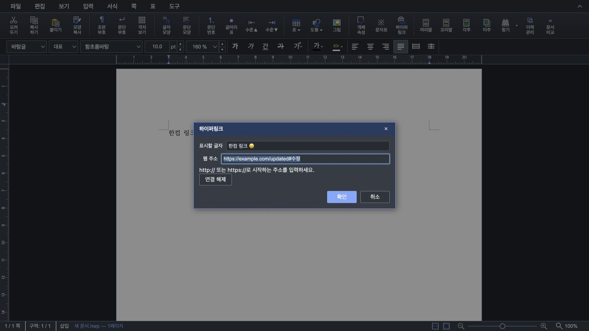

# 단계 4 — Studio 하이퍼링크 편집 연결

- Issue: [#6963](https://github.com/edwardkim/rhwp/issues/6963)
- 실행일: 2026-09-10
- 기준: 단계 3 커밋 `6b8e890e9`
- 상태: Studio 버튼·메뉴·단축키·대화상자 및 편집 history 연결 완료.

## 사용자 동작

도구 상자의 하이퍼링크 버튼과 입력 메뉴를 활성화하고 `Ctrl+K → H`를 연결했다.
Mac은 기존 플랫폼 단축키 처리 규칙을 따르며 한글 IME의 `ㅗ`도 등록했다.
기존 링크 안에 커서를 놓거나 링크 안의 글자를 선택하면 주소 수정과 연결 해제를 제공한다.
일반 글자를 선택하면 그 문자열에 링크를 붙인다. 선택이 없으면 표시할 글자를 입력해
커서 위치에 새 링크를 넣는다. 선택 문자열과 기존 링크의 표시 글자는 이 대화상자에서
변경하지 않는다. 글자 서식도 기존 값을 유지한다.

여러 문단·여러 링크에 걸친 선택, 캡션, 머리말·꼬리말·각주, 셀/개체 선택 모드는 차단한다.
양식 모드와 읽기 전용에서는 명령을 실행하지 않는다. 링크 끝 경계의 커서는 다음 글자
기준으로 해석한다. 바로 옆 링크가 있으면 그 링크를 편집하며, 링크가 없으면 신규 삽입이다.

실패하면 입력값과 대화상자를 유지하며 오류를 표시한다. 취소·닫기 뒤 편집기 포커스를
복원한다. 모달을 연 뒤 문서 세대·대상 문단 내용·편집 가능 상태가 바뀌면 오래된 범위를
적용하지 않는다.

## 구현 경계

- `src/wasm_api/hyperlink.rs`: 코어 API의 JSON options 어댑터 4개. 누락·음수·비정수
  좌표를 기본 본문 위치로 바꾸지 않고 오류로 반환한다.
- `rhwp-studio/src/core/hyperlink.ts`: 본문/중첩 셀/글상자 주소와 선택 범위 판정.
- `rhwp-studio/src/command/commands/hyperlink.ts`: `executeOperation`의 snapshot으로
  삽입·수정·해제를 묶는다. 새 글자 삽입 뒤 필드 검증이 실패해도 전체 문서를 복원한다.
- 동일 주소 수정은 라우터 호출 전에 종료해 history·dirty·refresh를 만들지 않는다.
  실제 변경은 기존 full refresh의 문서 변경 이벤트를 사용하고 수동 dirty 이벤트를 중복 emit하지 않는다.
- `rhwp-studio/src/ui/hyperlink-dialog.ts`: 공통 모달과 테마 토큰을 사용한다.
  주소·표시 글자의 명시적 label, dialog 이름, 오류 alert를 제공한다.

공개 호출 예제는 [소비자 편집 API 가이드](../manual/consumer_edit_api_guide.md)에 추가했다.
이 단계는 편집기 화면에서 URL을 클릭해 외부 사이트로 이동시키는 기능을 추가하지 않는다.

## 검증

- TypeScript `--noEmit` 통과.
- 최종 Studio Node 회귀: **1,501 통과 / 2 skipped / 0 실패**.
  새 주소/선택 판정 테스트 4개와 기존 mutation routing guard를 포함한다.
- native 및 WASM library Clippy `-D warnings`, review worktree의 fmt·manifest check 통과.
- 실제 WASM 빌드 통과. Docker CLI는 있으나 데몬이 실행되지 않아 문서가 허용한
  native wrapper의 `--no-opt` 진단 경로를 사용했다. 최적화 배포 빌드의 증거는 아니다.
- 실제 WASM + Studio Command/Bridge/History를 연결한 focused runner **10개 시나리오 통과**.
  모달 DOM과 InputHandler의 외곽만 테스트 드라이버로 대체하며 command와 snapshot/history,
  WASM 브리지·Rust 편집·HWP/HWPX 직렬화는 실제 구현을 실행한다.

[WASM 시나리오 결과](assets/issue6963/stage4/wasm-command-validation.json):

1. 무선택 삽입·잘못된 URL의 원자 복원·snapshot undo/redo.
2. 동일 주소 무기록·주소 수정 undo/redo.
3. Studio 브리지로 편집한 본문 링크의 HWP/HWPX 저장 왕복.
4. 연결 해제의 문자열 보존·undo/redo.
5. 선택 문자열에 신규 링크 삽입.
6. 외부 내용 변경과 문서 교체 세대 차단.
7. 모달이 열린 뒤 읽기 전용 전환 차단.
8. 한컴 LH 샘플의 실제 2단계 중첩 셀에서 기존 링크 수정·신규 글자/링크 삽입·undo.
9. 실제 글상자의 새 링크·undo/redo·HWP/HWPX 저장 왕복.
10. WASM JSON 경계에서 잘못된 입력 거부와 문서 불변.

재현 명령:

```bash
# review worktree에서 빌드. --out-dir은 검증할 source worktree의 pkg 절대 경로로 지정한다.
CARGO_TARGET_DIR=target/pr-review scripts/wasm-pack-locked.sh --target web --out-dir /path/to/source/pkg --no-opt
cargo clippy --locked -p rhwp --lib --target-dir target/pr-review -- -D warnings
cargo clippy --locked -p rhwp --lib --target wasm32-unknown-unknown --target-dir target/pr-review -- -D warnings
cargo fmt --all -- --check
node scripts/rust-test-suite-manifest.mjs --check
# source worktree의 rhwp-studio에서 실행
npm exec tsc -- --noEmit
npm test
node --experimental-transform-types --no-warnings tests/support/hyperlink-wasm.runner.mjs
```

마지막 runner는 pkg가 필요한 별도 focused 검사이며 일반 `npm test`에 포함하지 않는다.
`RHWP_HYPERLINK_EVIDENCE_DIR`를 지정하면 결과 JSON을 저장한다.

## 실제 화면 확인

새로 빌드한 WASM과 source worktree의 Vite(`127.0.0.1:7763`)를 사용했다.
Browser 도구의 실제 UI 조작으로 다음을 확인했다.

- 도구 버튼과 입력 메뉴에서 대화상자 열기, `Ctrl+K → H`로 기존 링크 수정 열기.
- `javascript:` 입력 시 오류 표시 후 유효한 한글·query·fragment 주소로 재시도 성공.
- 새 글자와 링크 삽입, 주소 수정 undo/redo, 연결 해제와 undo 복원.
- 글자 선택 후 삽입 시 표시 글자 읽기 전용, undo 뒤 원래 선택 문자열 복원.
- 취소 후 편집 입력 요소로 포커스 복원. 취소 이후에도 redo가 유지됨.
- 링크 편집 세션 뒤 새로 만들기를 실행하면 저장하지 않은 변경사항 경고가 나타남.
  [경고 DOM 기록](assets/issue6963/stage4/unsaved-warning.txt)을 남기고 취소해 문서를 유지했다.



브라우저 화면의 실제 중첩 셀·글상자 포커스 여정은 이번 수동 확인에 포함하지 않았다.
해당 컨텍스트의 모델 편집·저장 왕복은 위 WASM runner로
확인했으며, 전체 사용자 여정과 브라우저 PDF 결과는 단계 5에서 확인한다.

## 발견한 별도 경계와 남은 작업

처음 runner를 `HwpDocument.createEmpty()`만으로 구성했을 때 HWP5 재열기에서 링크 시작이
문단 끝으로 이동하는 현상을 관찰했다. Studio의 새 문서는 `createEmpty()` 직후
`createBlankDocument()`로 내장 HWP 템플릿을 로드하므로 실제 Studio 경로로 수정한 runner는
통과했다. 최소 IR의 secd 보강 저장 경계는 별도 후속 조사 대상으로 남긴다.
이 관찰을 Studio 저장 실패로 보고하거나 최소 IR 저장 성공으로 확대하지 않는다.

단계 5: 실제 Studio 저장·재열기, 브라우저 인쇄 PDF의 annotation 파싱·뷰어 클릭 확인.
단계 3의 native PDF 성공이나 SVG anchor 존재만으로 브라우저 PDF 성공을 판정하지 않는다.
PR 준비의 전체 workspace/release/Native Skia/배포 WASM 게이트는 아직 실행하지 않았고,
원격 push·PR 생성·merge는 수행하지 않았다. 원래 checkout의 사용자 변경
`samples/exam_eng.pdf`는 그대로 보존했다.
