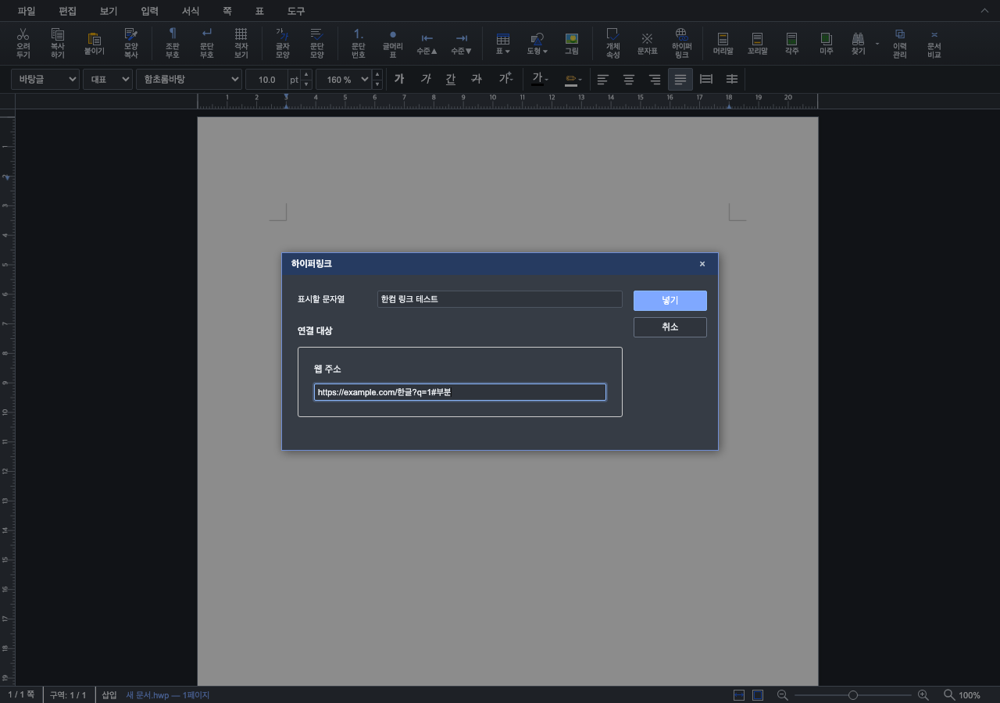
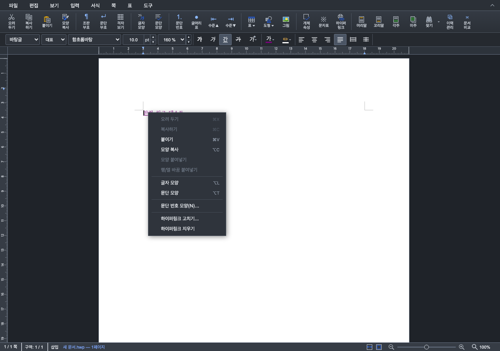

# 단계 7 — 한컴 캡처 기반 Studio 하이퍼링크 UX 보완

- Issue: #6963, PR: #6984
- 시작일: 2026-09-10
- 기준: `cdebbd9db`, 사용자 제공 한컴 캡처 5장
- 상태: 로컬 구현·검증 완료. 기존 PR의 CI를 이번 변경의 CI 결과로 사용하지 않는다.

## 사용자 요구와 구현 범위

한컴 대화상자의 표시할 문자열·연결 대상 배치와 넣기/고치기/취소 문구를 따른다.
이미 링크인 글자에 입력 명령을 실행하면 고칠지 확인하며, 우클릭에는 하이퍼링크
고치기·지우기를 표시한다. 새 링크의 파란색·밑줄, 주소 열기와 방문 색을 지원한다.
문서 보안 수준 설정창은 만들지 않고 명시적 사용자 동작으로 HTTP/HTTPS만 연다.
사용자 후속 피드백에 따라 웹 주소만 표시한다. 파일·한글 문서·전자 우편과 미지원 설명 문자열 항목은 숨기고 대화상자의 불필요한 높이를 줄인다.

## 검증 계획

새 링크·기존 링크 확인/취소·우클릭 위치·지우기·서식과 undo/redo·주소 열기·방문 색,
HWP/HWPX 저장 왕복과 실제 PDF 주석 보존을 focused WASM 및 Chrome에서 확인한다.
기존 사용자 테스트 서버는 유지한다. 원본 checkout의 samples/exam_eng.pdf는 보존한다.

## 구현 결과와 동작 경계

- 한컴 캡처의 오른쪽 넣기/고치기·취소 배치와 문구를 적용하되, 마지막 사용자 지시대로
  표시할 문자열과 웹 주소만 남겼다. 기존 링크는 문서에서 표시 글자를 편집하고 대화상자는 주소를 고친다.
- 기존 링크에서 도구 상자의 입력 명령을 실행하면 고침/취소 확인창을 연다. 우클릭 고치기는 바로 편집창을 연다.
- 우클릭의 실제 글자 영역으로 링크를 선택해 고치기·지우기를 표시한다. 빈 페이지나 지운 링크에는 표시하지 않는다.
- 새 링크는 파란색 `#0000ff`와 밑줄을 같은 snapshot에 적용한다. 지우기는 표시 문자열을 보존하고 검정·밑줄 없음으로 바꾼다.
- 링크 글자를 일반 클릭하면 새 탭을 열고 보라색 `#800080`으로 바꾼다. 드래그 선택은 URL을 열지 않는다.
  방문 색은 문서 글자 서식 변경이므로 dirty/history에 포함된다. 브라우저 방문 이력을 읽거나 추적하지 않는다.
  링크 열기의 성공은 새 탭 핸들 생성과 이동 요청 기준이며 외부 사이트 응답 성공을 의미하지 않는다.
- 기존 HTTP/HTTPS 외 주소는 실행하지 않는다. 새 탭은 빈 페이지에서 opener를 끊은 뒤 이동한다.
  문서 보안 수준 설정창은 구현하지 않았다.
- Rust/WASM API 변경 없이 기존 서식·선택 영역·snapshot API를 사용했다. 기존 검증 WASM을 재사용했다.

## 검증 결과

| 검증 | 결과 |
| --- | --- |
| TypeScript | 통과 |
| Studio Node 전체 | 1,501 pass / 2 skip / 0 fail |
| production bundle | 통과 |
| 실제 WASM command/history runner | 10그룹 통과, 신규 파랑·밑줄 및 HWP/HWPX 재열기 서식 검사 포함 |
| Chrome UI E2E | 입력·기존 링크 확인/취소·고치기·우클릭 지우기·undo/redo·일반 클릭 방문 색·드래그 무이동·빈 공간 메뉴 통과 |
| 기존 Chrome 저장·PDF E2E | HWP/HWPX 저장·재열기·PDF 5종 81개 주석·PDF 뷰어 클릭 통과 |
| PDF 독립 파서 | 자체 인쇄 DOM 대비 최대 오차 0.381pt 미만 |

UI E2E는 포인터 이벤트로 실제 클릭 경로를 실행하고 `window.open`의 새 탭 핸들만 대체해
목적지와 opener 해제를 확인한다. 외부 서버 접속은 실행하지 않았다. 실제 Chrome PDF 뷰어
클릭 검증은 기존 PDF E2E가 별도로 수행한다. 처음 UI E2E는 테스트가 없는 `undo()`를 호출해
실패했으며 실제 공개 `performUndo()/performRedo()`로 수정한 뒤 최종 두 회 모두 통과했다.
최종 웹 주소 전용 창을 직접 열어 크기·라벨·버튼과 빈 여백 축소를 확인했다.

실행 명령은 `rhwp-studio/` 기준이다.

```bash
npm exec tsc -- --noEmit
npm test
npm run build
node --experimental-transform-types --no-warnings tests/support/hyperlink-wasm.runner.mjs
CHROME_PATH=/path/to/chrome VITE_URL=http://127.0.0.1:7763 node e2e/hyperlink-ui-issue6963.test.mjs --mode=headless
CHROME_PATH=/path/to/chrome VITE_URL=http://127.0.0.1:7763 PYTHON=/path/to/python node e2e/hyperlink-pdf-issue6963.test.mjs --mode=headless
```

임시 출력은 `output/issue6963-stage7/`, PDF는 `output/pdf/issue6963-stage5/`다.
원시 로그·JSON·중간 화면은 커밋하지 않는다. 최종 대표 화면 두 장만 보존한다.





로컬 서버 `http://127.0.0.1:7763/`에 반영했다. 이번 UX 보완의 원격 push·PR 본문 갱신·merge는 실행하지 않았다.
