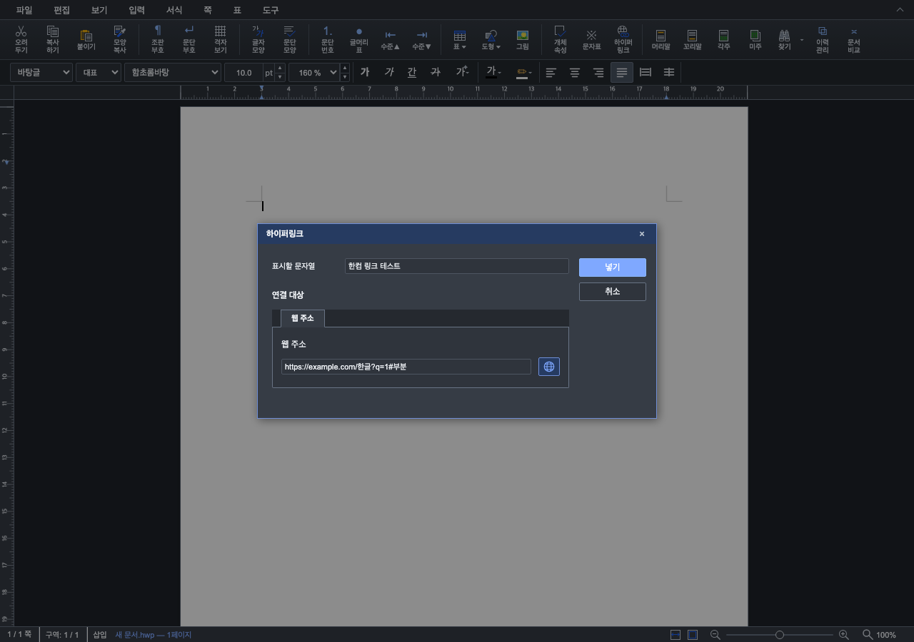
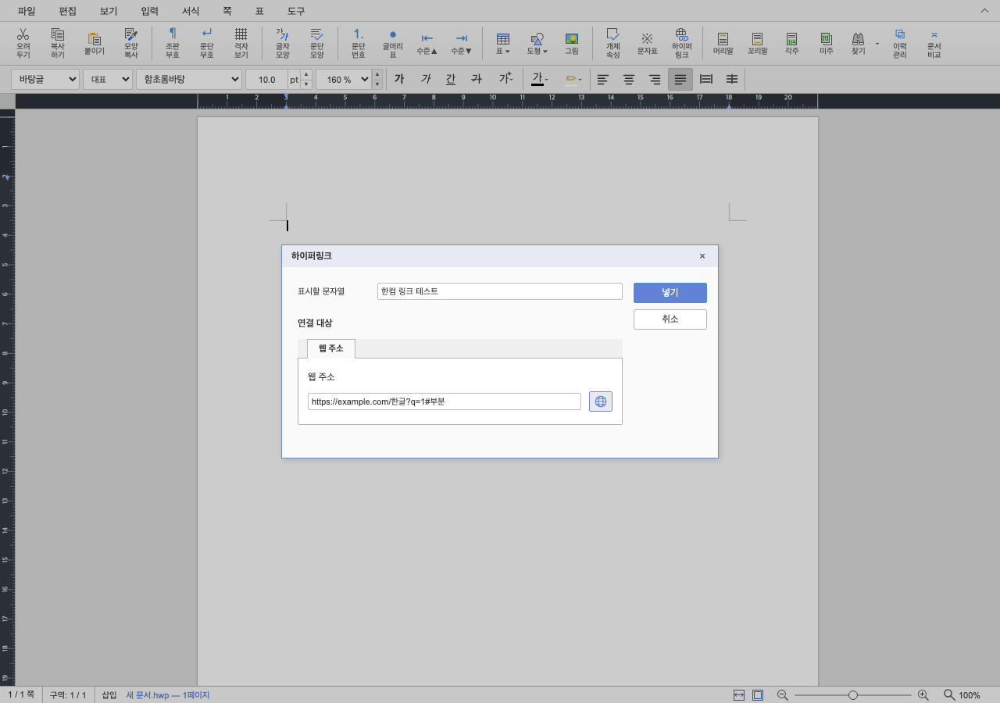

# 단계 8 — 웹 주소 탭·미리 열기·공통 모달 토큰

- Issue: #6963 / PR: #6984
- 실행일: 2026-09-10
- 기준: `df4a43cf2`
- 상태: 로컬 구현·검증 완료, 원격 게시 미실행

## 사용자 피드백과 변경

표시할 문자열은 유지되어 있다. 단계 7에서 제거한 항목은 미지원 설명할 문자열이었다.
연결 대상에는 공통 `dialog-tabs`/`dialog-tab`으로 웹 주소 탭 하나만 표시한다.
추후 책갈피 지원 시 탭을 추가하고 해당 패널을 전환하며 표시할 문자열·넣기/고치기·취소는
공통 영역에 유지하는 구조다. 아직 없는 연결 대상은 선노출하지 않는다.

주소 옆 지구본은 현재 입력한 HTTP/HTTPS 주소를 새 탭에서 연다. 문서에 링크를 삽입하거나
방문 서식·dirty를 변경하지 않으며 모달도 닫지 않는다. 빈 주소·미지원 scheme·인증 정보가
포함된 URL·공백 및 역슬래시가 포함된 주소는 비활성화한다. 새 탭의 opener를 끊고 이동한다.
지구본은 플랫폼별 이모지 대신 `currentColor` SVG와 공통 `dialog-btn`을 사용한다.

## 공통 디자인 점검

제목·배경·그림자·글꼴·입력·확인/취소는 기존 ModalDialog 및 dialog-* 스타일을 재사용하고 있었다.
별도였던 테두리 fallback `--border-color/#ccc`는 `--ui-border-strong`, 오류색 `#df6464`는
`--ui-danger`, 패널 radius는 `--radius-sm`으로 바꿨다. 탭은 글자 모양 대화상자와 같은
클래스, 내용 영역은 `dialog-section`, 지구본 색은 `--color-primary`를 사용한다.
전용 CSS는 오른쪽 버튼 배치·주소 행 크기·간격과 좁은 화면 배치를 담당한다.

## 검증

- TypeScript 통과, URL/대상 focused Node 5/5 통과.
- 실제 Chrome UI E2E 통과: 웹 주소 단일 탭, 빈 URL의 미리 열기 비활성화, Unicode 주소 이동,
  opener 해제, 미리 열기 전후 문서 context·dirty 불변과 모달 유지.
- 같은 여정에서 파란색/방문 색·기존 링크 확인/취소·우클릭 고치기/지우기·undo/redo·드래그 무이동도 통과.
- 새 탭 핸들은 테스트에서 대체했으며 외부 서버에는 연결하지 않았다.
- 밝은/어두운 테마 화면을 각각 생성하고 직접 열어 라벨·테두리·탭·지구본을 확인했다.
- Rust/저장/PDF 코드는 이번 단계에서 변경하지 않아 단계 7의 PDF 81개 주석 회귀를 반복하지 않았다.

임시 산출은 `output/issue6963-stage7/`에 있다. 최종 대표 모달 두 장만 보존한다.

