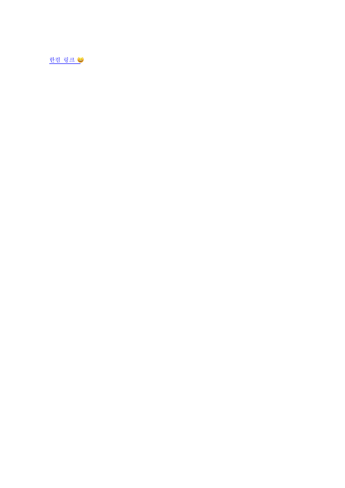

# 단계 9 — 표시 문자열 편집·호버 안내 제거

- Issue: #6963 / PR: #6984
- 실행일: 2026-09-10
- 기준: `bc08a41d4`
- 상태: 표시 문자열 구현, 설명 문자열은 한컴 원본 확인 대기. 원격 게시 미실행.

## 구현

표시 문자열 입력을 읽기 전용에서 해제했다. 선택한 일반 문자열에 링크를 넣을 때에도
입력한 문자열로 교체하고, 기존 링크에서는 전체 링크의 표시 문자열을 교체한다.
대상 문단과 필드 ID를 함께 받는 native/WASM API로 인접 링크와 기존 메타데이터를 유지한다.
새 글자는 기존 링크 첫 글자의 서식을 이어받고, 링크 색상·밑줄 및 방문 색상을 유지한다.
주소와 표시 문자열 변경은 Studio의 한 snapshot에 묶여 undo/redo 및 오류 복원이 적용된다.
주소와 표시 문자열이 모두 같으면 undo 이력을 만들지 않는다.

호버의 `클릭하여 열기 · 우클릭하여 고치기/지우기` 안내를 제거했다. 현재는 주소만 보인다.
모달의 공통 입력 스타일과 디자인 토큰은 그대로 사용한다.

## 설명 문자열 — 아직 미구현

[한컴 공식 도움말](https://help.hancom.com/hoffice130/ko-KR/Hwp/insert/hyperlink/hyperlink.htm)은
설명할 문자열을 호버 설명으로 정의한다. 그러나 저장소의 2022 ParameterSet 공개 문서는
HyperLink에 Text/Command/NoLink/ShapeObject/DirectInsert만 명시하며, Command 문법도
TARGET/LINK_TYPE/OBJ_TYPE/OPTION만 설명한다.

저장소 HWPX 표본의 모든 하이퍼링크를 조사했지만 설명값이 있는 표본은 확인되지 않았다.
Field의 ctrl_data_name은 필드 이름이며, 이를 설명으로 임의 해석하지 않았다.
또한 임의의 HWPX 문자열 파라미터는 HWP5 저장 시 소실되므로 UI만 연결한 상태로 노출하지 않았다.
한컴에서 설명할 문자열에 식별 가능한 값을 입력해 저장한 HWP/HWPX 한 쌍을 받아
저장 위치를 확인한 후 설명 입력·수정·삭제·호버·왕복 테스트를 이어가야 한다.

## 검증

- native hyperlink 회귀 12개 통과: Unicode 길이 증가/감소, 인접 링크 경계·ID 보존,
  HWP/HWPX 왕복, 빈 문자열/제어 문자 거부와 기존 회귀.
- 실제 WASM+Studio snapshot 11그룹 통과: 표시 문자열 수정·ID 보존·저장 왕복·undo/redo,
  한컴 중첩 셀의 표시 문자열 수정 및 두 형식 저장 왕복 포함.
- Chrome UI E2E 통과: 읽기 전용 해제, 실제 표시 문자열 변경, 방문 색상 유지,
  호버 title이 주소와 정확히 일치하며 기존 조작 안내가 없는지 검사.
- 최종 WASM 재빌드 및 실제 WASM 11그룹 재실행 통과.
- Rust fmt, native lib Clippy, WASM lib Clippy, TypeScript 및 Studio build 통과.
- Chrome PDF E2E 통과: 표시 문자열을 먼저 변경한 뒤 HWP/HWPX 저장·재열기·PDF 출력.
  5개 PDF, 34쪽, 81개 링크 주석 검증. 최대 사각형 오차 0.381pt 미만.
  Chrome PDF 뷰어에서 실제 링크 영역 클릭으로 URI 이동 확인.
- 새로 출력한 PDF를 PNG로 렌더링해 파란색·밑줄과 수정한 표시 문자열을 직접 확인했다.
- 원격 push/PR 갱신은 하지 않았으며 전체 workspace lint 게이트는 게시 전에 별도로 필요하다.

